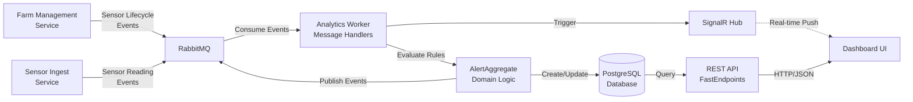
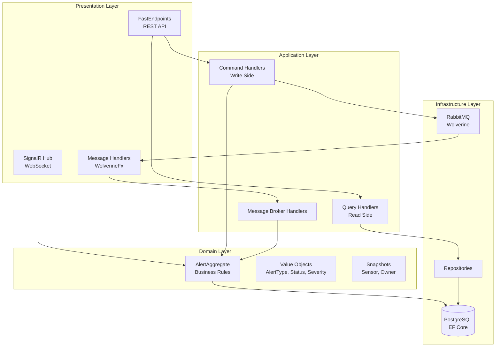

# TC.Agro Analytics Worker 🌾

[](https://dotnet.microsoft.com/)
[](https://docs.microsoft.com/en-us/dotnet/csharp/)
[](https://github.com/rdpresser/tc-agro-analytics-worker)
[](https://github.com/rdpresser/tc-agro-analytics-worker)
[](https://github.com/rdpresser/tc-agro-analytics-worker)
[](LICENSE)

> **Event-Driven Microservice** for processing agricultural IoT sensor data with automatic alert detection and real-time notifications.

---

## 📋 Table of Contents

- [Overview](#-overview)
- [Architecture](#-architecture)
- [Technologies](#-technologies)
- [Prerequisites](#-prerequisites)
- [Quick Start](#-quick-start)
- [Configuration](#-configuration)
- [Running](#-running)
- [Testing](#-testing)
- [Project Structure](#-project-structure)
- [Domain-Driven Design](#-domain-driven-design)
- [Supported Alerts](#-supported-alerts)
- [REST API](#-rest-api)
- [Real-Time Notifications (SignalR)](#-real-time-notifications-signalr)
- [Metrics & Observability](#-metrics--observability)
- [Documentation](#-documentation)
- [Contributing](#-contributing)
- [License](#-license)

---

## 🎯 Overview

**TC.Agro Analytics Worker** is a specialized microservice for processing agricultural IoT sensor data in real-time. It:

- ✅ **Processes events** from sensor readings via RabbitMQ
- ✅ **Evaluates business rules** for anomaly detection (high temperature, dry soil, low battery)
- ✅ **Generates automatic alerts** with complete lifecycle (Pending → Acknowledged → Resolved)
- ✅ **Notifies in real-time** via SignalR WebSocket to connected dashboards
- ✅ **Exposes REST API** for alert queries and history
- ✅ **Maintains snapshots** of sensors and owners for query optimization
- ✅ **Persists data** in PostgreSQL via Entity Framework Core
- ✅ **Ensures consistency** with Wolverine Outbox Pattern

### Processing Flow



---

## 🏗️ Architecture

This project implements **Clean Architecture** with **Domain-Driven Design** (DDD) and **CQRS**:



### Architectural Patterns

- ✅ **Clean Architecture** - Separation of concerns in layers
- ✅ **Domain-Driven Design (DDD)** - Rich domain modeling with Aggregates and Value Objects
- ✅ **CQRS** - Separation of commands (write) and queries (read)
- ✅ **Event-Driven Architecture** - Asynchronous communication via RabbitMQ
- ✅ **Outbox Pattern** - Transactional consistency of messages (Wolverine)
- ✅ **Repository Pattern** - Persistence abstraction
- ✅ **Result Pattern** - Error handling without exceptions
- ✅ **Snapshot Pattern** - Denormalized data cache for query optimization

---

## 🛠️ Technologies

### Core

- **.NET 10.0** - Modern, high-performance framework
- **C# 14.0** - Programming language with advanced features

### API & Web

- **FastEndpoints 7.2** - Minimalist, high-performance API framework
- **SignalR** - Real-time bidirectional communication (WebSocket)
- **Swagger/OpenAPI** - Automatic API documentation

### Persistence

- **Entity Framework Core 10.0** - Modern ORM for .NET
- **PostgreSQL 16+** - Relational database
- **Npgsql 10.0** - High-performance PostgreSQL driver

### Message Broker

- **WolverineFx 5.15** - Messaging framework with integrated Outbox Pattern
- **RabbitMQ 4.0** - Enterprise-grade message broker

### Observability

- **Serilog 4.1** - Structured logging
- **OpenTelemetry** - Distributed tracing and metrics
- **Azure Monitor / Application Insights** - APM (Application Performance Monitoring)

### Testing

- **xUnit v3 (3.2.2)** - Unit testing framework
- **FakeItEasy 9.0** - Mocking framework
- **FastEndpoints.Testing 7.2** - Helpers for endpoint testing

### Tools

- **Ardalis.Result 10.1** - Result Pattern for error handling
- **FluentValidation 12.1** - Data validations
- **Polly 8.6** - Resilience (retry, circuit breaker)
- **AspNetCore.HealthChecks.NpgSql 9.0** - PostgreSQL health checks

---

## 📦 Prerequisites

### Required Software

```bash
# .NET SDK 10.0 or higher
dotnet --version
# Expected output: 10.0.x

# Docker (to run dependencies locally)
docker --version
# Expected output: 24.0.x or higher

# Docker Compose (optional for local development)
docker-compose --version
# Expected output: 2.x or higher
```

### External Dependencies

#### Production (Cloud)
- **PostgreSQL** - Managed database in the cloud (Azure Database, AWS RDS, or other provider)
- **RabbitMQ** - Managed message broker (CloudAMQP, Azure Service Bus, or other provider)

#### Local Development
- **PostgreSQL 16+** (via Docker or local installation)
- **RabbitMQ 4.0+** (via Docker or local installation)

### Shared Packages

This project depends on shared packages from the `tc-agro-common` repository:
- `TC.Agro.Contracts` - Integration events and DTOs
- `TC.Agro.Messaging` - Messaging configurations
- `TC.Agro.SharedKernel` - Base classes (Aggregate, Repository, etc.)

---

## 🚀 Quick Start

### Option 1: Automatic Setup (Recommended)

```powershell
# Windows PowerShell
.\scripts\setup-e2e.ps1

# Linux/Mac
chmod +x scripts/setup-e2e.sh
./scripts/setup-e2e.sh
```

This script automatically:
- ✅ Verifies prerequisites
- ✅ Starts Docker containers (PostgreSQL + RabbitMQ)
- ✅ Applies database migrations
- ✅ Configures RabbitMQ (exchanges, queues, bindings)
- ✅ Compiles the application
- ✅ Runs unit tests

**Estimated time:** 2-3 minutes

### Option 2: Manual Setup

```bash
# 1. Clone the repository
git clone https://github.com/rdpresser/tc-agro-analytics-worker.git
cd tc-agro-analytics-worker

# 2. Restore dependencies
dotnet restore

# 3. Start dependencies with Docker (local development)
docker-compose up -d

# 4. Apply migrations
dotnet ef database update --project src/Adapters/Outbound/TC.Agro.Analytics.Infrastructure --startup-project src/Adapters/Inbound/TC.Agro.Analytics.Service

# 5. Run the application
dotnet run --project src/Adapters/Inbound/TC.Agro.Analytics.Service
```

**Verify it's working:**

```bash
# Health check
curl http://localhost:5174/health

# Swagger UI
open http://localhost:5174/swagger
```

**📖 Detailed guides:**
- [Quick Start E2E](docs/QUICK_START_E2E.md) - Quick setup in 5 minutes
- [RUN_PROJECT.md](docs/RUN_PROJECT.md) - Complete execution guide
- [E2E Testing Guide](docs/E2E_TESTING_GUIDE.md) - Complete end-to-end tests

---

## ⚙️ Configuration

### Configuration Structure

The project uses ASP.NET Core's hierarchical configuration pattern:

```
appsettings.json (base - empty by default)
├── appsettings.Development.json (local development)
├── appsettings.Production.json (production/cloud)
└── Environment Variables (Docker/Kubernetes - override)
```

### appsettings.Development.json (Example)

```json
{
  "ConnectionStrings": {
    "DefaultConnection": "Host=localhost;Port=5432;Database=tc-agro-analytics-db;Username=postgres;Password=postgres"
  },
  "RabbitMQ": {
    "Host": "localhost",
    "Port": 5672,
    "Username": "guest",
    "Password": "guest"
  },
  "AlertThresholds": {
    "MaxTemperature": 35.0,
    "MinSoilMoisture": 20.0,
    "MinBatteryLevel": 15.0
  },
  "TimeZone": "America/Sao_Paulo"
}
```

### appsettings.Production.json (Cloud Example)

```json
{
  "ConnectionStrings": {
    "DefaultConnection": "Host=your-db-server.com;Port=5432;Database=tc-agro-analytics-db;Username=postgres;Password=${DB_PASSWORD};SSL Mode=Require"
  },
  "RabbitMQ": {
    "Host": "xxx.cloudamqp.com",
    "Port": 5672,
    "Username": "xxx",
    "Password": "${RABBITMQ_PASSWORD}",
    "VirtualHost": "xxx"
  },
  "AlertThresholds": {
    "MaxTemperature": 38.0,
    "MinSoilMoisture": 18.0,
    "MinBatteryLevel": 12.0
  },
  "ApplicationInsights": {
    "ConnectionString": "${APPLICATIONINSIGHTS_CONNECTION_STRING}"
  }
}
```

### Environment Variables (Docker/Kubernetes)

```bash
# Database
export ConnectionStrings__DefaultConnection="Host=postgres;Port=5432;Database=tc-agro-analytics-db;Username=postgres;Password=${DB_PASSWORD}"

# RabbitMQ
export RabbitMQ__Host=rabbitmq
export RabbitMQ__Password=${RABBITMQ_PASSWORD}

# Alert Thresholds
export AlertThresholds__MaxTemperature=40
export AlertThresholds__MinSoilMoisture=15
export AlertThresholds__MinBatteryLevel=10

# Observability
export ApplicationInsights__ConnectionString=${APPINSIGHTS_CONN_STRING}
```

### Configuration via Azure App Configuration (Optional)

For cloud environments, it's recommended to use **Azure App Configuration** or **AWS Parameter Store** to centralize configurations and secrets.

---

## 🏃 Running

### Local Development

```bash
# Run with hot reload (recommended)
dotnet watch run --project src/Adapters/Inbound/TC.Agro.Analytics.Service

# Or without hot reload
dotnet run --project src/Adapters/Inbound/TC.Agro.Analytics.Service
```

**Expected output:**
```
info: Microsoft.Hosting.Lifetime[14]
      Now listening on: http://localhost:5174
info: WolverineFx[0]
      Wolverine messaging service is starting
info: Wolverine.RabbitMQ[0]
      Connected to RabbitMQ at localhost:5672
      Listening to queue: 'analytics.sensor.reading.queue'
```

**Available endpoints:**
- API: `http://localhost:5174`
- Swagger UI: `http://localhost:5174/swagger`
- Health Check: `http://localhost:5174/health`
- SignalR Hub: `ws://localhost:5174/dashboard/alertshub`

### Production (Build & Publish)

```bash
# Optimized build
dotnet build -c Release

# Publish artifacts
dotnet publish -c Release -o ./publish

# Run
cd publish
dotnet TC.Agro.Analytics.Service.dll
```

### Docker

#### Build Image

```bash
docker build -t tc-agro-analytics-worker:latest .
```

#### Run Container

```bash
docker run -d \
  --name analytics-worker \
  -p 5174:8080 \
  -e ConnectionStrings__DefaultConnection="Host=postgres;Port=5432;Database=tc-agro-analytics-db;Username=postgres;Password=postgres" \
  -e RabbitMQ__Host=rabbitmq \
  -e RabbitMQ__Password=guest \
  --network tc-agro-network \
  tc-agro-analytics-worker:latest
```

### Health Checks

```bash
# Check general health
curl http://localhost:5174/health

# Expected response:
{
  "status": "Healthy",
  "timestamp": "2025-02-01T20:00:00Z",
  "service": "Analytics Worker Service"
}
```

### Testing Complete Flow

1. **Publish test message to RabbitMQ:**

```bash
# Using Python script
python scripts/publish_test_message.py --scenario high-temp

# Or using curl (direct to RabbitMQ Management API)
curl -u guest:guest -X POST http://localhost:15672/api/exchanges/%2F/analytics.sensor.reading/publish \
  -H "Content-Type: application/json" \
  -d '{
    "properties": {},
    "routing_key": "sensor.reading",
    "payload": "{\"sensorId\":\"550e8400-e29b-41d4-a716-446655440001\",\"temperature\":42.5}",
    "payload_encoding": "string"
  }'
```

2. **Check application logs:**

```bash
# Logs should show:
info: SensorIngestedInHandler - Processing sensor reading for sensor 550e8400...
warn: SensorIngestedInHandler - Alert created: HighTemperature for sensor 550e8400...
info: AlertHubNotifier - Real-time notification sent via SignalR
```

3. **Query alerts via API:**

```bash
# View pending alerts
curl http://localhost:5174/api/alerts/pending | jq

# View alert history for a sensor
curl "http://localhost:5174/api/alerts/history/550e8400-e29b-41d4-a716-446655440001?days=30" | jq
```

📖 **Complete guide:** [RUN_PROJECT.md](docs/RUN_PROJECT.md)

---

## 🧪 Testing

### Run All Tests

```bash
# Complete suite
dotnet test

# With details
dotnet test --verbosity normal

# Only tests from a category
dotnet test --filter "FullyQualifiedName~Domain"
dotnet test --filter "FullyQualifiedName~Application"
```

### Run with Code Coverage

```bash
# Collect coverage
dotnet test --collect:"XPlat Code Coverage"

# Generate HTML report (requires ReportGenerator)
dotnet tool install -g dotnet-reportgenerator-globaltool

reportgenerator \
  -reports:"**/coverage.cobertura.xml" \
  -targetdir:"coveragereport" \
  -reporttypes:Html

# Open report
start coveragereport/index.html  # Windows
open coveragereport/index.html   # Mac/Linux
```

### Test Structure

```
test/TC.Agro.Analytics.Tests/
├── Domain/
│   ├── Aggregates/
│   │   └── AlertAggregateTests.cs          # Aggregate root tests
│   ├── ValueObjects/
│   │   ├── AlertTypeTests.cs
│   │   ├── AlertStatusTests.cs
│   │   ├── AlertSeverityTests.cs
│   │   └── AlertThresholdsTests.cs
│   └── Snapshots/
│       ├── SensorSnapshotTests.cs
│       └── OwnerSnapshotTests.cs
├── Application/
│   ├── MessageBrokerHandlers/
│   │   ├── SensorIngestedInHandlerTests.cs
│   │   ├── SensorSnapshotHandlerTests.cs
│   │   └── OwnerSnapshotHandlerTests.cs
│   └── UseCases/
│       ├── AcknowledgeAlertCommandHandlerTests.cs
│       ├── ResolveAlertCommandHandlerTests.cs
│       └── GetPendingAlertsQueryHandlerTests.cs
└── Infrastructure/
    └── Repositories/
        └── AlertAggregateRepositoryTests.cs (integration tests)
```

### Tests in Watch Mode

```bash
# Run tests automatically on file save
dotnet watch test --project test/TC.Agro.Analytics.Tests
```

### Integration Tests (E2E)

For complete end-to-end tests with RabbitMQ and PostgreSQL:

```bash
# Automatic setup and execution
.\scripts\setup-e2e.ps1  # Windows
./scripts/setup-e2e.sh   # Linux/Mac
```

📖 **Detailed guides:**
- [TESTING_GUIDE.md](docs/TESTING_GUIDE.md) - Complete testing guide
- [E2E_TESTING_GUIDE.md](docs/E2E_TESTING_GUIDE.md) - End-to-end tests
- [VALIDATION_CHECKLIST.md](docs/VALIDATION_CHECKLIST.md) - Validation checklist

---

## 📂 Project Structure

```
tc-agro-analytics-worker/
├── src/
│   ├── Core/                                           # Domain + Application Logic
│   │   ├── TC.Agro.Analytics.Domain/
│   │   │   ├── Aggregates/
│   │   │   │   ├── AlertAggregate.cs                   # 🎯 Aggregate Root with business rules
│   │   │   │   └── AnalyticsDomainErrors.cs            # Domain errors
│   │   │   ├── ValueObjects/
│   │   │   │   ├── AlertType.cs                        # HighTemperature, LowSoilMoisture, LowBattery, SensorOffline
│   │   │   │   ├── AlertStatus.cs                      # Pending, Acknowledged, Resolved, Expired
│   │   │   │   ├── AlertSeverity.cs                    # Low, Medium, High, Critical
│   │   │   │   └── AlertThresholds.cs                  # Configurable thresholds
│   │   │   ├── Snapshots/
│   │   │   │   ├── SensorSnapshot.cs                   # Denormalized sensor cache
│   │   │   │   └── OwnerSnapshot.cs                    # Denormalized owner cache
│   │   │   └── Abstractions/
│   │   │       └── DomainError.cs                      # Base error class
│   │   │
│   │   └── TC.Agro.Analytics.Application/
│   │       ├── MessageBrokerHandlers/                  # 📨 WolverineFx Handlers
│   │       │   ├── SensorIngestedInHandler.cs          # Processes sensor readings
│   │       │   ├── SensorSnapshotHandler.cs            # Maintains sensor snapshots
│   │       │   └── OwnerSnapshotHandler.cs             # Maintains owner snapshots
│   │       ├── UseCases/Alerts/                        # 🎯 CQRS Handlers
│   │       │   ├── GetPendingAlerts/
│   │       │   │   ├── GetPendingAlertsQuery.cs
│   │       │   │   └── GetPendingAlertsQueryHandler.cs
│   │       │   ├── GetAlertHistory/
│   │       │   │   ├── GetAlertHistoryQuery.cs
│   │       │   │   └── GetAlertHistoryQueryHandler.cs
│   │       │   ├── GetSensorStatus/
│   │       │   │   ├── GetSensorStatusQuery.cs
│   │       │   │   └── GetSensorStatusQueryHandler.cs
│   │       │   ├── AcknowledgeAlert/
│   │       │   │   ├── AcknowledgeAlertCommand.cs
│   │       │   │   └── AcknowledgeAlertCommandHandler.cs
│   │       │   └── ResolveAlert/
│   │       │       ├── ResolveAlertCommand.cs
│   │       │       └── ResolveAlertCommandHandler.cs
│   │       ├── Abstractions/Ports/
│   │       │   ├── IAlertAggregateRepository.cs        # Repository interface
│   │       │   └── IAlertHubNotifier.cs                # SignalR notifier interface
│   │       └── DependencyInjection.cs
│   │
│   └── Adapters/                                       # Infrastructure & Presentation
│       ├── Inbound/                                    # 🌐 Presentation Layer
│       │   └── TC.Agro.Analytics.Service/
│       │       ├── Program.cs                          # Bootstrap + DI Container
│       │       ├── Endpoints/Alerts/                   # 🚀 FastEndpoints
│       │       │   ├── GetPendingAlertsEndpoint.cs
│       │       │   ├── GetAlertHistoryEndpoint.cs
│       │       │   ├── GetSensorStatusEndpoint.cs
│       │       │   ├── AcknowledgeAlertEndpoint.cs
│       │       │   └── ResolveAlertEndpoint.cs
│       │       ├── Hubs/
│       │       │   └── AlertHub.cs                     # 📡 SignalR Hub
│       │       ├── Services/
│       │       │   └── AlertHubNotifier.cs             # SignalR notification service
│       │       ├── Middleware/
│       │       │   └── TelemetryMiddleware.cs          # OpenTelemetry middleware
│       │       ├── Extensions/
│       │       │   └── ServiceCollectionExtensions.cs  # DI extensions
│       │       ├── appsettings.json
│       │       ├── appsettings.Development.json
│       │       └── appsettings.Production.json
│       │
│       └── Outbound/                                   # 🗄️ Infrastructure Layer
│           └── TC.Agro.Analytics.Infrastructure/
│               ├── Repositories/
│               │   ├── BaseRepository.cs               # Generic repository base
│               │   └── AlertAggregateRepository.cs     # Alert repository (EF Core)
│               ├── Persistence/
│               │   ├── AnalyticsDbContext.cs           # EF Core DbContext
│               │   └── Configurations/                 # Entity configurations
│               │       ├── AlertAggregateConfiguration.cs
│               │       ├── SensorSnapshotConfiguration.cs
│               │       └── OwnerSnapshotConfiguration.cs
│               ├── Migrations/                         # EF Core migrations
│               │   └── 20250201_InitialCreate.cs
│               └── DependencyInjection.cs
│
├── test/
│   └── TC.Agro.Analytics.Tests/
│       ├── Domain/                                     # Domain tests (pure)
│       ├── Application/                                # Application tests (with mocks)
│       ├── Infrastructure/                             # Integration tests
│       ├── Builders/                                   # Test data builders
│       └── GlobalUsings.cs
│
├── docs/                                               # 📚 Technical documentation
│   ├── C4_ARCHITECTURE_DIAGRAMS.md                     # C4 Model diagrams (Mermaid)
│   ├── TESTING_GUIDE.md                                # Testing guide
│   ├── E2E_TESTING_GUIDE.md                            # End-to-end tests
│   ├── QUICK_START_E2E.md                              # Quick start
│   ├── RUN_PROJECT.md                                  # Execution guide
│   └── VALIDATION_CHECKLIST.md                         # Validation checklist
│
├── scripts/                                            # Utilities
│   ├── setup-e2e.ps1                                   # Automatic setup (Windows)
│   ├── setup-e2e.sh                                    # Automatic setup (Linux/Mac)
│   └── publish_test_message.py                         # Publish test messages
│
├── docker-compose.yml                                  # Local stack (PostgreSQL + RabbitMQ)
├── Dockerfile                                          # Production container
├── Directory.Packages.props                            # Central Package Management (CPM)
├── .editorconfig                                       # Code style
├── .gitignore
├── README.md                                           # 🇧🇷 Portuguese documentation
├── README_EN.md                                        # 🇺🇸 English documentation
└── LICENSE
```

### Layers and Responsibilities

| Layer | Responsibility | Dependencies |
|-------|----------------|--------------|
| **Domain** | Business rules, aggregates, value objects | None (pure domain) |
| **Application** | Use cases, handlers, interfaces | Domain |
| **Infrastructure** | Persistence, messaging, integrations | Application, Domain |
| **Presentation** | REST API, SignalR Hub, endpoints | Application |

---

## 🎨 Domain-Driven Design

### AlertAggregate (Aggregate Root)

The **AlertAggregate** is the heart of the domain, managing the entire alert lifecycle.

```csharp
// Factory method - Creates alerts from sensor data
var alerts = AlertAggregate.CreateFromSensorData(
    sensorSnapshot: sensorSnapshot,
    timestamp: DateTime.UtcNow,
    temperature: 42.5,
    soilMoisture: 35.0,
    batteryLevel: 85.0,
    thresholds: new AlertThresholds(
        maxTemperature: 35.0,
        minSoilMoisture: 20.0,
        minBatteryLevel: 15.0
    )
);

// Returns list of detected alerts (0 to N)
foreach (var alert in alerts)
{
    Console.WriteLine($"Alert: {alert.Type}, Severity: {alert.Severity}");
    // Alert: HighTemperature, Severity: Critical
}

// State transitions
alert.Acknowledge(userId: adminUserId);  // Pending → Acknowledged
alert.Resolve(userId: adminUserId, notes: "Irrigation activated");  // Acknowledged → Resolved
```

### Value Objects

#### **AlertType** - Alert Types

```csharp
public static class AlertType
{
    public static readonly AlertType HighTemperature = new("HighTemperature");
    public static readonly AlertType LowSoilMoisture = new("LowSoilMoisture");
    public static readonly AlertType LowBattery = new("LowBattery");
    public static readonly AlertType SensorOffline = new("SensorOffline");
}
```

#### **AlertStatus** - Lifecycle Status

```csharp
public static class AlertStatus
{
    public static readonly AlertStatus Pending = new("Pending");           // Newly created, awaiting action
    public static readonly AlertStatus Acknowledged = new("Acknowledged"); // Acknowledged, being handled
    public static readonly AlertStatus Resolved = new("Resolved");         // Resolved
    public static readonly AlertStatus Expired = new("Expired");           // Expired without action
}
```

#### **AlertSeverity** - Severity Levels

```csharp
public static class AlertSeverity
{
    public static readonly AlertSeverity Low = new("Low", level: 1);
    public static readonly AlertSeverity Medium = new("Medium", level: 2);
    public static readonly AlertSeverity High = new("High", level: 3);
    public static readonly AlertSeverity Critical = new("Critical", level: 4);
}
```

#### **AlertThresholds** - Threshold Configuration

```csharp
// Default values
var defaultThresholds = AlertThresholds.Default;
// MaxTemperature: 35°C
// MinSoilMoisture: 20%
// MinBatteryLevel: 15%

// Custom values
var customThresholds = new AlertThresholds(
    maxTemperature: 38.0,
    minSoilMoisture: 18.0,
    minBatteryLevel: 12.0
);
```

### Snapshots (Denormalization)

To optimize queries, we maintain snapshots (denormalized caches) of entities from other contexts:

#### **SensorSnapshot** - Sensor Cache

```csharp
public class SensorSnapshot
{
    public Guid Id { get; set; }              // SensorId
    public string Label { get; set; }         // "Sensor-001"
    public Guid PlotId { get; set; }
    public string PlotName { get; set; }      // "Plot A"
    public string PropertyName { get; set; }  // "Farm XYZ"
    public Guid OwnerId { get; set; }
    public SensorOperationalStatus Status { get; set; }  // Active, Inactive, Maintenance
    public DateTimeOffset LastReadingAt { get; set; }
}
```

#### **OwnerSnapshot** - Owner Cache

```csharp
public class OwnerSnapshot
{
    public Guid Id { get; set; }              // OwnerId (UserId)
    public string FullName { get; set; }      // "John Doe"
    public string Email { get; set; }
    public string? PhoneNumber { get; set; }
}
```

These snapshots are automatically updated via event handlers (`SensorSnapshotHandler`, `OwnerSnapshotHandler`).

### Business Rules

Alert detection rules are implemented in the `CreateFromSensorData()` method:

1. **High Temperature**
   - Condition: `temperature > thresholds.MaxTemperature`
   - Severity: Critical

2. **Low Soil Moisture**
   - Condition: `soilMoisture < thresholds.MinSoilMoisture`
   - Severity: High

3. **Low Battery**
   - Condition: `batteryLevel < thresholds.MinBatteryLevel`
   - Severity: Medium

4. **Sensor Offline**
   - Condition: `sensor.Status == SensorOperationalStatus.Inactive`
   - Severity: Critical

---

## 🚨 Supported Alerts

### 1. High Temperature 🌡️

**Condition:** `Temperature > MaxTemperature` (default: 35°C)

**Severity:** Critical

**Automatic Actions:**
- ✅ Creates alert in database (status: Pending)
- ✅ Publishes `HighTemperatureDetectedIntegrationEvent` event to RabbitMQ
- ✅ Notifies connected dashboards via SignalR in real-time

**Event Consumers:**
- **Alert Notification Service** → Sends SMS/Email/Push to farmer
- **Dashboard UI** → Displays visual and audible alert
- **Report Service** → Records in daily report

**Published Event Example:**
```json
{
  "eventId": "uuid",
  "occurredOn": "2025-02-01T14:00:00Z",
  "eventName": "HighTemperatureDetectedIntegrationEvent",
  "aggregateId": "alert-uuid",
  "sensorId": "550e8400-e29b-41d4-a716-446655440001",
  "sensorLabel": "Sensor-001",
  "plotId": "plot-uuid",
  "plotName": "Plot A",
  "temperature": 38.5,
  "threshold": 35.0,
  "severity": "Critical",
  "metadata": {
    "humidity": 65.0,
    "soilMoisture": 45.0
  }
}
```

---

### 2. Low Soil Moisture 💧

**Condition:** `SoilMoisture < MinSoilMoisture` (default: 20%)

**Severity:** High

**Automatic Actions:**
- ✅ Creates alert in database (status: Pending)
- ✅ Publishes `LowSoilMoistureDetectedIntegrationEvent` event to RabbitMQ
- ✅ Notifies connected dashboards via SignalR in real-time

**Event Consumers:**
- **Irrigation Service** → **Activates automatic irrigation** 🚰
- **Alert Notification Service** → Notifies need for action
- **Dashboard UI** → Displays irrigation recommendation

**Published Event Example:**
```json
{
  "eventId": "uuid",
  "occurredOn": "2025-02-01T14:00:00Z",
  "eventName": "LowSoilMoistureDetectedIntegrationEvent",
  "aggregateId": "alert-uuid",
  "sensorId": "550e8400-e29b-41d4-a716-446655440002",
  "sensorLabel": "Sensor-002",
  "plotId": "plot-uuid",
  "plotName": "Plot B",
  "soilMoisture": 15.0,
  "threshold": 20.0,
  "severity": "High"
}
```

---

### 3. Low Battery 🔋

**Condition:** `BatteryLevel < MinBatteryLevel` (default: 15%)

**Severity:** Medium

**Automatic Actions:**
- ✅ Creates alert in database (status: Pending)
- ✅ Publishes `BatteryLowWarningIntegrationEvent` event to RabbitMQ
- ✅ Notifies connected dashboards via SignalR in real-time

**Event Consumers:**
- **Maintenance Service** → Schedules battery replacement
- **Alert Notification Service** → Notifies technical team
- **Dashboard UI** → Displays maintenance warning

**Published Event Example:**
```json
{
  "eventId": "uuid",
  "occurredOn": "2025-02-01T14:00:00Z",
  "eventName": "BatteryLowWarningIntegrationEvent",
  "aggregateId": "alert-uuid",
  "sensorId": "550e8400-e29b-41d4-a716-446655440003",
  "sensorLabel": "Sensor-003",
  "plotId": "plot-uuid",
  "plotName": "Plot C",
  "batteryLevel": 10.0,
  "threshold": 15.0,
  "severity": "Medium"
}
```

---

### 4. Sensor Offline 📡❌

**Condition:** `sensor.Status == SensorOperationalStatus.Inactive`

**Severity:** Critical

**Automatic Actions:**
- ✅ Creates alert in database (status: Pending)
- ✅ Publishes `SensorOfflineDetectedIntegrationEvent` event to RabbitMQ
- ✅ Notifies connected dashboards via SignalR in real-time

**Event Consumers:**
- **Monitoring Service** → Records incident
- **Alert Notification Service** → Urgently notifies technical team
- **Dashboard UI** → Displays sensor as offline on map

---

## 🔌 REST API

### Base URL

- **Development:** `http://localhost:5174`
- **Production:** `https://api.tc-agro.com/analytics`

### Endpoints

#### 1. **GET /api/alerts/pending** - List Pending Alerts

Returns alerts with `Pending` status, ordered by severity and creation date.

**Query Parameters:**
- `pageNumber` (int, optional): Page number (default: 1)
- `pageSize` (int, optional): Page size (default: 10, max: 100)

**Response 200 OK:**
```json
{
  "alerts": [
    {
      "id": "6e1d2316-c80b-4f6e-87a7-661172cea2f3",
      "sensorId": "550e8400-e29b-41d4-a716-446655440001",
      "sensorLabel": "Sensor-001",
      "plotName": "Plot A",
      "propertyName": "Farm XYZ",
      "ownerName": "John Doe",
      "type": "HighTemperature",
      "message": "High temperature detected: 42.5°C (threshold: 35.0°C)",
      "status": "Pending",
      "severity": "Critical",
      "value": 42.5,
      "threshold": 35.0,
      "createdAt": "2025-02-01T14:00:00Z"
    }
  ],
  "totalCount": 15,
  "pageNumber": 1,
  "pageSize": 10,
  "hasNextPage": true,
  "hasPreviousPage": false
}
```

#### 2. **GET /api/alerts/history/{sensorId}** - Alert History

Returns alert history for a specific sensor.

**Path Parameters:**
- `sensorId` (Guid, required): Sensor ID

**Query Parameters:**
- `days` (int, optional): Period in days (default: 30, max: 365)
- `type` (string, optional): Filter by type (`HighTemperature`, `LowSoilMoisture`, `LowBattery`, `SensorOffline`)
- `status` (string, optional): Filter by status (`Pending`, `Acknowledged`, `Resolved`, `Expired`)
- `pageNumber` (int, optional): Page number (default: 1)
- `pageSize` (int, optional): Page size (default: 20, max: 100)

**Response 200 OK:**
```json
{
  "alerts": [
    {
      "id": "uuid",
      "type": "HighTemperature",
      "severity": "Critical",
      "message": "High temperature: 42.5°C",
      "value": 42.5,
      "threshold": 35.0,
      "status": "Resolved",
      "createdAt": "2025-02-01T14:00:00Z",
      "acknowledgedAt": "2025-02-01T14:15:00Z",
      "acknowledgedBy": "admin-user-id",
      "resolvedAt": "2025-02-01T15:30:00Z",
      "resolvedBy": "admin-user-id",
      "resolutionNotes": "Irrigation activated, temperature normalized"
    }
  ],
  "totalCount": 45,
  "pageNumber": 1,
  "pageSize": 20
}
```

#### 3. **GET /api/alerts/status/{sensorId}** - Current Sensor Status

Returns overview of alert status for a sensor.

**Response 200 OK:**
```json
{
  "sensorId": "550e8400-e29b-41d4-a716-446655440001",
  "sensorLabel": "Sensor-001",
  "plotName": "Plot A",
  "propertyName": "Farm XYZ",
  "hasActiveAlerts": true,
  "pendingAlertsCount": 2,
  "criticalAlertsCount": 1,
  "lastAlertAt": "2025-02-01T14:00:00Z",
  "lastReadingAt": "2025-02-01T14:30:00Z",
  "overallStatus": "Critical"
}
```

#### 4. **POST /api/alerts/{id}/acknowledge** - Acknowledge Alert

Changes status from `Pending` to `Acknowledged`.

**Request Body:**
```json
{
  "userId": "650e8400-e29b-41d4-a716-446655440001"
}
```

**Response 200 OK:**
```json
{
  "id": "alert-uuid",
  "status": "Acknowledged",
  "acknowledgedAt": "2025-02-01T14:15:00Z",
  "acknowledgedBy": "650e8400-e29b-41d4-a716-446655440001"
}
```

#### 5. **POST /api/alerts/{id}/resolve** - Resolve Alert

Changes status from `Acknowledged` to `Resolved`.

**Request Body:**
```json
{
  "userId": "650e8400-e29b-41d4-a716-446655440001",
  "resolutionNotes": "Irrigation manually activated. Temperature normalized after 1h."
}
```

**Response 200 OK:**
```json
{
  "id": "alert-uuid",
  "status": "Resolved",
  "resolvedAt": "2025-02-01T15:30:00Z",
  "resolvedBy": "650e8400-e29b-41d4-a716-446655440001",
  "resolutionNotes": "Irrigation manually activated. Temperature normalized after 1h."
}
```

### Swagger UI

Interactive documentation available at: `http://localhost:5174/swagger`

---

## 📡 Real-Time Notifications (SignalR)

### Hub Endpoint

**WebSocket URL:** `ws://localhost:5174/dashboard/alertshub`

### JavaScript Client

```javascript
// Connect to hub
const connection = new signalR.HubConnectionBuilder()
    .withUrl("http://localhost:5174/dashboard/alertshub")
    .withAutomaticReconnect()
    .build();

// Subscribe to alerts from specific sensors
await connection.start();
await connection.invoke("SubscribeToAlerts", ["550e8400-e29b-41d4-a716-446655440001"]);

// Receive real-time alerts
connection.on("ReceiveAlert", (alert) => {
    console.log("🚨 New alert:", alert);
    // { type: "HighTemperature", severity: "Critical", sensorLabel: "Sensor-001", ... }
});

// Receive acknowledgement notifications
connection.on("AlertAcknowledged", (alertId, userId) => {
    console.log(`✅ Alert ${alertId} acknowledged by ${userId}`);
});

// Receive resolution notifications
connection.on("AlertResolved", (alertId, userId, notes) => {
    console.log(`✔️ Alert ${alertId} resolved: ${notes}`);
});

// Unsubscribe
await connection.invoke("UnsubscribeFromAlerts", ["550e8400-e29b-41d4-a716-446655440001"]);
```

### Hub Methods

| Method | Parameters | Description |
|--------|------------|-------------|
| `SubscribeToAlerts` | `string[] sensorIds` | Subscribes to alerts from specific sensors |
| `UnsubscribeFromAlerts` | `string[] sensorIds` | Unsubscribes |

### Received Events

| Event | Payload | Description |
|-------|---------|-------------|
| `ReceiveAlert` | `AlertDto` | New alert created |
| `AlertAcknowledged` | `{ alertId, userId, timestamp }` | Alert acknowledged |
| `AlertResolved` | `{ alertId, userId, notes, timestamp }` | Alert resolved |

---

## 📈 Metrics & Observability

### Structured Logging (Serilog)

All logs are structured and enriched with context:

```json
{
  "timestamp": "2025-02-01T14:00:00.123Z",
  "level": "Warning",
  "message": "Alert created: HighTemperature for Sensor {SensorId}. Temperature: {Temperature}°C (Threshold: {Threshold}°C)",
  "properties": {
    "SensorId": "550e8400-e29b-41d4-a716-446655440001",
    "Temperature": 42.5,
    "Threshold": 35.0,
    "AlertId": "6e1d2316-c80b-4f6e-87a7-661172cea2f3",
    "CorrelationId": "trace-123",
    "ServiceName": "AnalyticsWorker",
    "Environment": "Production"
  }
}
```

**Configured sinks:**
- Console (development)
- File (rolling daily)
- Azure Monitor / Application Insights (production)
- Grafana Loki (optional)

### OpenTelemetry (Distributed Tracing)

Automatic instrumentation of:
- HTTP requests (FastEndpoints)
- Database calls (EF Core)
- RabbitMQ messages (WolverineFx)
- SignalR connections

**Traces exported to:**
- Azure Monitor / Application Insights
- Jaeger (local development)
- Grafana Tempo (optional)

### Metrics (OpenTelemetry Metrics)

Custom metrics implemented:

```csharp
// Counters
analytics_worker_alerts_created_total{type="HighTemperature",severity="Critical"}
analytics_worker_events_processed_total{handler="SensorIngestedInHandler"}
analytics_worker_signalr_notifications_sent_total

// Histograms
analytics_worker_processing_duration_seconds{handler="SensorIngestedInHandler"}
analytics_worker_database_query_duration_seconds{operation="GetPendingAlerts"}

// Gauges
analytics_worker_pending_alerts_count
analytics_worker_connected_signalr_clients
```

**Export:**
- Prometheus (scraping endpoint: `/metrics`)
- Azure Monitor
- Grafana Cloud

### Dashboards

#### **Grafana Dashboard - Analytics Worker**

- 📊 Event processing rate (events/s)
- 🚨 Alerts created by type and severity
- ⏱️ Average processing latency
- 💾 Database query performance
- 🔌 Connected SignalR clients
- ❌ Error and failure rate

#### **Azure Application Insights**

- Live Metrics (real-time)
- Application Map (dependencies)
- Transaction Search (distributed traces)
- Failures (exceptions and errors)
- Performance (slowest operations)

### Health Checks

Health check endpoints:

```bash
# Basic health check
GET /health
Response: 200 OK { "status": "Healthy" }

# Detailed health check
GET /health/detailed
Response: 200 OK
{
  "status": "Healthy",
  "checks": {
    "database": {
      "status": "Healthy",
      "responseTime": "15ms"
    },
    "rabbitmq": {
      "status": "Healthy",
      "responseTime": "8ms"
    }
  },
  "timestamp": "2025-02-01T14:00:00Z"
}
```

**Implemented checks:**
- PostgreSQL (connection + query test)
- RabbitMQ (connection + queue existence)
- Disk space
- Memory usage

---

## 📚 Documentation

### Complete Technical Documentation

| Document | Description | Link |
|----------|-------------|------|
| **C4 Architecture Diagrams** | 12 complete Mermaid diagrams of architecture (Context, Container, Component, etc.) | [📐 View Diagrams](docs/C4_ARCHITECTURE_DIAGRAMS.md) |
| **Testing Guide** | Complete guide for unit, integration, and E2E tests | [🧪 View Guide](docs/TESTING_GUIDE.md) |
| **E2E Testing Guide** | Setup and execution of end-to-end tests with RabbitMQ + PostgreSQL | [🔄 View Guide](docs/E2E_TESTING_GUIDE.md) |
| **Quick Start E2E** | Quick setup in 5 minutes | [⚡ View Guide](docs/QUICK_START_E2E.md) |
| **RUN_PROJECT.md** | Detailed execution and configuration guide | [🚀 View Guide](docs/RUN_PROJECT.md) |
| **Validation Checklist** | Complete step-by-step validation checklist | [✅ View Checklist](docs/VALIDATION_CHECKLIST.md) |

### Available Diagrams (Mermaid)

All diagrams are automatically rendered on GitHub:

✅ **Level 1 - Context:** System in TC.Agro ecosystem  
✅ **Level 2 - Container:** Containers, technologies, and communication  
✅ **Level 3 - Component (Query Side):** Endpoints, handlers, repositories  
✅ **Level 3 - Component (Command Side):** Message handlers and domain logic  
✅ **Clean Architecture:** Layers and dependencies  
✅ **CQRS Flow:** Separation of commands and queries  
✅ **Event Flow:** Complete event processing sequence  
✅ **Real-Time Flow:** SignalR notifications  
✅ **Deployment:** Cloud architecture (Azure/AWS)  
✅ **Domain Model:** Class diagram with aggregates and value objects  
✅ **Database Schema:** Data model (EF Core)  
✅ **Security:** Authentication, authorization, and communication security  

### API Documentation

- **Swagger UI:** `http://localhost:5174/swagger` (development environment)
- **OpenAPI Spec:** `http://localhost:5174/swagger/v1/swagger.json`

### External Documentation

| Technology | Official Documentation |
|------------|----------------------|
| .NET 10 | https://learn.microsoft.com/en-us/dotnet/ |
| Entity Framework Core | https://learn.microsoft.com/en-us/ef/core/ |
| WolverineFx | https://wolverine.netlify.app/ |
| FastEndpoints | https://fast-endpoints.com/ |
| SignalR | https://learn.microsoft.com/en-us/aspnet/core/signalr/ |
| RabbitMQ | https://www.rabbitmq.com/documentation.html |
| PostgreSQL | https://www.postgresql.org/docs/ |

---

## 🧑‍💻 Contributing

Contributions are welcome! 🎉

### Development Flow

1. **Fork** the repository
2. Create a **feature branch** (`git checkout -b feature/new-feature`)
3. **Commit** your changes using [Conventional Commits](#commit-standards)
4. Run **tests** (`dotnet test`)
5. **Push** to the branch (`git push origin feature/new-feature`)
6. Open a **Pull Request** with detailed description

### Commit Standards

We follow [Conventional Commits](https://www.conventionalcommits.org/):

```bash
feat: add endpoint for report export
fix: correct alert severity calculation
docs: update README with new endpoints
test: add tests for AlertAggregate
refactor: improve SensorIngestedInHandler performance
chore: update project dependencies
perf: optimize pending alerts query
style: format code following .editorconfig
```

### Code Style

The project follows **.editorconfig** conventions:

- Indentation: 4 spaces
- Naming: PascalCase for classes, camelCase for variables
- Maximum line length: 120 characters
- Use `var` when type is obvious
- Always use `{}` in if/for/while blocks
- Order usings alphabetically

### Run Tests Before Committing

```bash
# Build without errors
dotnet build

# All tests passing
dotnet test

# Check code style (optional)
dotnet format --verify-no-changes
```

### Code Review Checklist

- [ ] ✅ Code follows DDD and Clean Architecture principles
- [ ] ✅ Unit tests added/updated (minimum coverage: 80%)
- [ ] ✅ Build passes without warnings
- [ ] ✅ All tests pass
- [ ] ✅ Commit message follows Conventional Commits
- [ ] ✅ Documentation updated (if needed)
- [ ] ✅ No commented code or console.logs
- [ ] ✅ Variables and methods with descriptive names
- [ ] ✅ Proper error handling (Result Pattern)
- [ ] ✅ Structured logs added where relevant

### Report Bugs

Open an issue with:
- **Clear title:** e.g., "Low battery alert is not being created"
- **Description:** What happened vs. what should happen
- **Steps to reproduce:** Numbered list
- **Environment:** OS, .NET version, Docker version
- **Logs:** Attach relevant logs (use `dotnet run --verbosity detailed`)

---

## 📄 License

This project is licensed under the **MIT License**.

```
MIT License

Copyright (c) 2025 FIAP - Class 3NETT

Permission is hereby granted, free of charge, to any person obtaining a copy
of this software and associated documentation files (the "Software"), to deal
in the Software without restriction, including without limitation the rights
to use, copy, modify, merge, publish, distribute, sublicense, and/or sell
copies of the Software, and to permit persons to whom the Software is
furnished to do so, subject to the following conditions:

The above copyright notice and this permission notice shall be included in all
copies or substantial portions of the Software.

THE SOFTWARE IS PROVIDED "AS IS", WITHOUT WARRANTY OF ANY KIND, EXPRESS OR
IMPLIED, INCLUDING BUT NOT LIMITED TO THE WARRANTIES OF MERCHANTABILITY,
FITNESS FOR A PARTICULAR PURPOSE AND NONINFRINGEMENT. IN NO EVENT SHALL THE
AUTHORS OR COPYRIGHT HOLDERS BE LIABLE FOR ANY CLAIM, DAMAGES OR OTHER
LIABILITY, WHETHER IN AN ACTION OF CONTRACT, TORT OR OTHERWISE, ARISING FROM,
OUT OF OR IN CONNECTION WITH THE SOFTWARE OR THE USE OR OTHER DEALINGS IN THE
SOFTWARE.
```

See [LICENSE](LICENSE) file for complete details.

---

## 🤝 Credits

**Developed by:** [FIAP - Class 3NETT](https://www.fiap.com.br) - Postgraduate in .NET Software Architecture

**Architecture:** Clean Architecture + Domain-Driven Design + CQRS + Event-Driven Architecture

**Main Technologies:**
- [.NET 10](https://dotnet.microsoft.com/) - Modern, high-performance framework
- [Entity Framework Core 10](https://learn.microsoft.com/en-us/ef/core/) - Powerful ORM
- [WolverineFx 5](https://wolverine.netlify.app/) - Message Bus with Outbox Pattern
- [FastEndpoints 7](https://fast-endpoints.com/) - Minimalist API framework
- [SignalR](https://learn.microsoft.com/en-us/aspnet/core/signalr/) - Real-time communication
- [PostgreSQL 16](https://www.postgresql.org/) - Robust relational database
- [RabbitMQ 4](https://www.rabbitmq.com/) - Enterprise message broker

**Patterns & Practices:**
- Clean Architecture (Robert C. Martin)
- Domain-Driven Design (Eric Evans)
- CQRS (Command Query Responsibility Segregation)
- Event-Driven Architecture
- Outbox Pattern (consistency guarantee)
- Repository Pattern
- Result Pattern (Ardalis)

---

## 📞 Support

**Issues:** [GitHub Issues](https://github.com/rdpresser/tc-agro-analytics-worker/issues)

**Email:** support@tc-agro.com

**Discussions:** [GitHub Discussions](https://github.com/rdpresser/tc-agro-analytics-worker/discussions)

---

## 🎯 Roadmap

### ✅ v1.0.0 (Current - Release 2025-02-01)

- [x] Clean Architecture with DDD
- [x] Complete CQRS (Command/Query separation)
- [x] Event-Driven Architecture with RabbitMQ
- [x] Outbox Pattern (Wolverine) for transactional consistency
- [x] 4 alert types (HighTemp, LowSoilMoisture, LowBattery, SensorOffline)
- [x] Complete alert lifecycle (Pending → Acknowledged → Resolved)
- [x] REST API with FastEndpoints
- [x] Real-time notifications with SignalR
- [x] Snapshots for query optimization
- [x] OpenTelemetry (traces + metrics)
- [x] Unit and integration tests
- [x] 12 C4 Model diagrams (Mermaid)
- [x] Complete technical documentation
- [x] Docker Compose for local development
- [x] Health Checks

### 🚧 v1.1.0 (Next Release - Q2 2025)

- [ ] Pre-configured Grafana dashboards
- [ ] Alerts with automatic expiration (configurable TTL)
- [ ] Multi-language support (i18n)
- [ ] Advanced API filters (by severity, custom date range)
- [ ] Report export (PDF, Excel)
- [ ] Redis cache for frequent queries
- [ ] Rate limiting and throttling
- [ ] Circuit breaker with Polly

### 🔮 v2.0.0 (Future - Q4 2025)

- [ ] Machine Learning for alert prediction (Azure ML)
- [ ] Historical pattern analysis
- [ ] Automatic action recommendations
- [ ] GraphQL API (in addition to REST)
- [ ] Support for custom webhooks
- [ ] Integrations with Telegram, Slack, Microsoft Teams
- [ ] Mobile dashboard (Blazor Hybrid)
- [ ] Support for multiple sensor types (weather, soil, pests)

---

<div align="center">

**⭐ If this project was helpful, consider giving it a star on GitHub!**

[](https://github.com/rdpresser/tc-agro-analytics-worker)

---

**🌾 TC.Agro Solutions - Technology for Smart Agribusiness**

[Website](https://tc-agro.com) • [GitHub](https://github.com/rdpresser) • [LinkedIn](https://linkedin.com/company/tc-agro)

</div>
