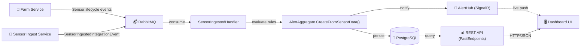
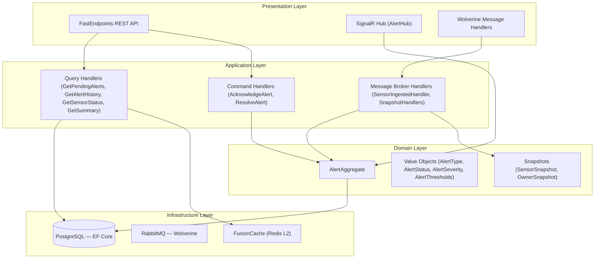

# TC.Agro Analytics Service 📈

[](https://dotnet.microsoft.com/)
[](https://docs.microsoft.com/en-us/dotnet/csharp/)
[](https://github.com/rdpresser/tc-agro-analytics-worker)
[](https://github.com/rdpresser/tc-agro-analytics-worker)
[](https://github.com/rdpresser/tc-agro-analytics-worker)
[](LICENSE)

> **Alert Detection & Management Microservice** — evaluates sensor readings against configurable thresholds, manages alert lifecycle, and pushes real-time notifications via SignalR.

---

## 📋 Table of Contents

- [Overview](#-overview)
- [Architecture](#-architecture)
- [Technologies](#-technologies)
- [Prerequisites](#-prerequisites)
- [Quick Start](#-quick-start)
- [Configuration](#-configuration)
- [Running](#-running)
- [API Endpoints](#-api-endpoints)
- [Alert Rules](#-alert-rules)
- [Real-Time Notifications (SignalR)](#-real-time-notifications-signalr)
- [Messaging](#-messaging)
- [Metrics & Observability](#-metrics--observability)
- [Testing](#-testing)
- [Project Structure](#-project-structure)
- [Domain-Driven Design](#-domain-driven-design)
- [License](#-license)

---

## 🎯 Overview

**TC.Agro Analytics Service** is responsible for detecting anomalies in sensor data, managing alert lifecycle, and broadcasting real-time notifications to connected dashboards. It:

- ✅ **Processes sensor reading events** from RabbitMQ via Wolverine
- ✅ **Evaluates alert rules** for anomaly detection (high temperature, dry soil, low battery)
- ✅ **Generates alerts** with full lifecycle — Pending → Acknowledged → Resolved
- ✅ **Exposes REST API** for alert queries and lifecycle management
- ✅ **Pushes real-time notifications** via SignalR to connected dashboard clients
- ✅ **Maintains snapshots** of sensors and owners for enriched query responses
- ✅ **Caches read queries** with FusionCache (L1 + Redis L2)
- ✅ **Ensures consistency** with Wolverine Transactional Outbox Pattern

### Processing Flow


```mermaid
graph LR
    Farm["🌾 Farm Service"] -->|Sensor lifecycle events| MQ["📬 RabbitMQ"]
    Ingest["📡 Sensor Ingest Service"] -->|SensorIngestedIntegrationEvent| MQ
    MQ -->|consume| Handler["SensorIngestedHandler"]
    Handler -->|evaluate rules| Domain["AlertAggregate.CreateFromSensorData()"]
    Domain -->|persist| DB[("🐘 PostgreSQL")]
    Domain -->|notify| Hub["📡 AlertHub (SignalR)"]
    Hub -.live push.-> UI["🖥️ Dashboard UI"]
    DB -->|query| API["📊 REST API (FastEndpoints)"]
    API -->|HTTP/JSON| UI
```

---

## 🏗️ Architecture

Clean Architecture with DDD and CQRS:


```mermaid
graph TB
    subgraph "Presentation Layer"
        A["FastEndpoints REST API"]
        B["SignalR Hub (AlertHub)"]
        C["Wolverine Message Handlers"]
    end
    subgraph "Application Layer"
        D["Query Handlers (GetPendingAlerts, GetAlertHistory, GetSensorStatus, GetSummary)"]
        E["Command Handlers (AcknowledgeAlert, ResolveAlert)"]
        F["Message Broker Handlers (SensorIngestedHandler, SnapshotHandlers)"]
    end
    subgraph "Domain Layer"
        G["AlertAggregate"]
        H["Value Objects (AlertType, AlertStatus, AlertSeverity, AlertThresholds)"]
        I["Snapshots (SensorSnapshot, OwnerSnapshot)"]
    end
    subgraph "Infrastructure Layer"
        J[("PostgreSQL — EF Core")]
        K["RabbitMQ — Wolverine"]
        L["FusionCache (Redis L2)"]
    end

    A --> D & E
    B --> G
    C --> F
    D --> J & L
    E --> G
    F --> G & I
    G --> J
```

**Patterns:** Clean Architecture · DDD · CQRS · Outbox Pattern · Snapshot Pattern · Result Pattern

---

## 🛠️ Technologies

| Category | Technology |
|---|---|
| Runtime | .NET 10 / C# 14 |
| API | FastEndpoints 7.2 |
| Real-time | SignalR |
| ORM | Entity Framework Core 10 |
| Database | PostgreSQL 16 |
| Cache | FusionCache 2.0 + Redis 7 |
| Messaging | WolverineFx 5.15 + RabbitMQ 4 |
| Observability | OpenTelemetry · Serilog · Prometheus |
| Validation | FluentValidation 12 · Ardalis.Result |
| Testing | xUnit v3 · FakeItEasy · FastEndpoints.Testing |

---

## 📦 Prerequisites

```bash
dotnet --version   # 10.0.x
docker --version   # 24.0.x or higher
```

**Shared packages** (from `tc-agro-common`): `TC.Agro.Contracts`, `TC.Agro.Messaging`, `TC.Agro.SharedKernel`

---

## 🚀 Quick Start

```bash
git clone https://github.com/rdpresser/tc-agro-analytics-worker.git
cd tc-agro-analytics-worker

# Start infrastructure (PostgreSQL, Redis, RabbitMQ)
docker compose up -d

# Apply migrations
dotnet ef database update \
  --project src/Adapters/Outbound/TC.Agro.Analytics.Infrastructure \
  --startup-project src/Adapters/Inbound/TC.Agro.Analytics.Service

# Run the service
dotnet run --project src/Adapters/Inbound/TC.Agro.Analytics.Service
```

**Verify:**
```bash
curl http://localhost:5004/health/ready
# open http://localhost:5004/swagger
```

---

## ⚙️ Configuration

```json
// appsettings.Development.json (key fields)
{
  "ConnectionStrings": {
    "DefaultConnection": "Host=localhost;Port=5432;Database=tc-agro-analytics-db;Username=postgres;Password=postgres",
    "Redis": "localhost:6379,abortConnect=false"
  },
  "RabbitMQ": {
    "Host": "localhost",
    "Port": 5672,
    "Username": "guest",
    "Password": "guest"
  },
  "AlertThresholds": {
    "MaxTemperature": 35.0,
    "MinSoilMoisture": 20.0,
    "MinBatteryLevel": 15.0
  }
}
```

**Environment variables (Docker/Kubernetes):**
```bash
export ConnectionStrings__DefaultConnection="Host=postgres;..."
export ConnectionStrings__Redis="redis:6379"
export RabbitMQ__Host=rabbitmq
export AlertThresholds__MaxTemperature=35.0
export AlertThresholds__MinSoilMoisture=20.0
export AlertThresholds__MinBatteryLevel=15.0
```

---

## 🏃 Running

```bash
dotnet watch run --project src/Adapters/Inbound/TC.Agro.Analytics.Service
```

**Available:**

| URL | Purpose |
|---|---|
| `http://localhost:5004/swagger` | API documentation |
| `http://localhost:5004/health/live` | Liveness probe |
| `http://localhost:5004/health/ready` | Readiness probe (PostgreSQL + Redis) |
| `http://localhost:5004/metrics` | Prometheus metrics |
| `ws://localhost:5004/alertshub` | SignalR Hub |

---

## 🔌 API Endpoints

All endpoints require **JWT Bearer Token**.

### Alert Queries

| Method | Path | Roles | Description |
|---|---|---|---|
| `GET` | `/alerts/pending` | Admin, Producer, User | Pending alerts, paginated + cached |
| `GET` | `/alerts/history` | Admin, Producer, User | Alert history, paginated + cached |
| `GET` | `/alerts/summary` | Admin, Producer, User | Summary counts by severity and status |
| `GET` | `/sensors/{id}/status` | Admin, Producer, User | Aggregated sensor status from active alerts |

**Query params for `/alerts/pending` and `/alerts/history`:** `pageNumber`, `pageSize`, `ownerId` (Admin only), `severity`, `status`, `search`

**Scoping:** Producer users see only alerts for their own sensors. Admin users can filter by `ownerId`.

**`GET /alerts/pending` response example:**
```json
{
  "data": [
    {
      "id": "6e1d2316-c80b-4f6e-87a7-661172cea2f3",
      "sensorId": "550e8400-e29b-41d4-a716-446655440001",
      "alertType": "HighTemperature",
      "message": "High temperature detected: 42.5°C",
      "status": "Pending",
      "severity": "Critical",
      "value": 42.5,
      "threshold": 35.0,
      "createdAt": "2026-02-27T14:00:00Z",
      "plotName": "Plot Norte",
      "propertyName": "Fazenda Alpha"
    }
  ],
  "totalCount": 15,
  "pageNumber": 1,
  "pageSize": 20
}
```

### Alert Lifecycle

| Method | Path | Roles | Description |
|---|---|---|---|
| `POST` | `/alerts/{id}/acknowledge` | Admin, Producer | Pending → Acknowledged |
| `POST` | `/alerts/{id}/resolve` | Admin, Producer | Pending / Acknowledged → Resolved |

**Acknowledge request:**
```json
{ "userId": "650e8400-e29b-41d4-a716-446655440001" }
```

**Resolve request:**
```json
{
  "userId": "650e8400-e29b-41d4-a716-446655440001",
  "resolutionNotes": "Irrigation activated. Temperature normalized after 1h."
}
```

---

## 🚨 Alert Rules

Rules are evaluated in `AlertAggregate.CreateFromSensorData()` on every `SensorIngestedIntegrationEvent`. All thresholds are configurable via `AlertThresholds` in `appsettings.json`.

| Metric | Condition | Alert Type | Severity Calculation |
|---|---|---|---|
| `Temperature` | > `MaxTemperature` (default 35°C) | `HighTemperature` | Low (<5°C excess) / Medium (<10°C) / High (<15°C) / Critical (≥15°C) |
| `SoilMoisture` | < `MinSoilMoisture` (default 20%) | `LowSoilMoisture` | Low (<10% deficit) / Medium (<20%) / High (<30%) / Critical (≥30%) |
| `BatteryLevel` | < `MinBatteryLevel` (default 15%) | `LowBattery` | Medium (<30%) / High (<20%) / Critical (<10%) |

Each rule evaluation is independent — a single sensor reading can trigger multiple alerts simultaneously.

**Metadata:** each alert stores a JSON `Metadata` field with the other sensor readings at the time of detection (e.g., a `HighTemperature` alert includes humidity, soilMoisture, rainfall, batteryLevel as context).

---

## 📡 Real-Time Notifications (SignalR)

**Hub endpoint:** `ws://localhost:5004/alertshub`  
**Auth:** JWT Bearer Token (query string `access_token` or Authorization header)

```javascript
const connection = new signalR.HubConnectionBuilder()
    .withUrl("http://localhost:5004/alertshub", {
        accessTokenFactory: () => localStorage.getItem("jwtToken")
    })
    .withAutomaticReconnect()
    .build();

connection.on("AlertCreated", (alert) => {
    // { alertId, sensorId, alertType, severity, message, value, threshold, createdAt }
    showAlertNotification(alert);
});

connection.on("AlertAcknowledged", (alertId, userId, acknowledgedAt) => {
    updateAlertStatus(alertId, "Acknowledged");
});

connection.on("AlertResolved", (alertId, userId, resolvedAt, notes) => {
    updateAlertStatus(alertId, "Resolved");
});

await connection.start();
```

**Events pushed to connected clients:**

| Event | Trigger | Payload |
|---|---|---|
| `AlertCreated` | New alert detected | `alertId, sensorId, alertType, severity, message, value, threshold, createdAt` |
| `AlertAcknowledged` | Alert acknowledged | `alertId, userId, acknowledgedAt` |
| `AlertResolved` | Alert resolved | `alertId, userId, resolvedAt, resolutionNotes` |

---

## 📨 Messaging

### Consumed Events

| Event | Source | Action |
|---|---|---|
| `SensorIngestedIntegrationEvent` | Sensor Ingest Service | Evaluate alert rules → create alerts if thresholds exceeded |
| `UserCreatedIntegrationEvent` | Identity Service | Create `OwnerSnapshot` |
| `UserUpdatedIntegrationEvent` | Identity Service | Update `OwnerSnapshot` |
| `UserDeactivatedIntegrationEvent` | Identity Service | Deactivate `OwnerSnapshot` |
| `SensorRegisteredIntegrationEvent` | Farm Service | Create `SensorSnapshot` |
| `SensorOperationalStatusChangedIntegrationEvent` | Farm Service | Update `SensorSnapshot.Status` |
| `SensorDeactivatedIntegrationEvent` | Farm Service | Deactivate `SensorSnapshot` |

> The Analytics Service currently does not publish integration events. Alerts are exposed via REST API and SignalR only.

---

## 📊 Metrics & Observability

- **`/metrics`** — Prometheus exposition format (HTTP, DB queries, Wolverine, FusionCache, custom alert counters)
- **`/health/live`** — liveness probe
- **`/health/ready`** — readiness probe (PostgreSQL + Redis)

**Custom metrics:** alerts created by type and severity, alert processing latency, SignalR connected clients, acknowledgement and resolution rates.

**Distributed tracing:** W3C Trace Context + `X-Correlation-Id` header propagated through all requests and RabbitMQ messages. Exportable via OTLP to Grafana Tempo.

**Local access:** Grafana `http://localhost:3000` · Prometheus `http://localhost:9090`

---

## 🧪 Testing

```bash
dotnet test
dotnet test --filter "FullyQualifiedName~Domain"
dotnet test --filter "FullyQualifiedName~Application"
dotnet test --collect:"XPlat Code Coverage"
```

**Test structure:**
```
test/TC.Agro.Analytics.Tests/
├── Domain/
│   ├── Aggregates/       # AlertAggregateTests — creation, severity calc, lifecycle transitions
│   ├── ValueObjects/     # AlertType, AlertStatus, AlertSeverity, AlertThresholds
│   └── Snapshots/        # SensorSnapshot, OwnerSnapshot
├── Application/
│   ├── MessageBrokerHandlers/  # SensorIngestedHandler, SensorSnapshotHandler, OwnerSnapshotHandler
│   └── UseCases/         # GetPendingAlerts, GetAlertHistory, AcknowledgeAlert, ResolveAlert
└── Service/
    └── Endpoints/        # GetPendingAlerts, GetSensorStatus
```

---

## 📂 Project Structure

```
tc-agro-analytics-worker/
├── src/
│   ├── Core/
│   │   ├── TC.Agro.Analytics.Domain/
│   │   │   ├── Aggregates/
│   │   │   │   └── AlertAggregate.cs           # alert rules, lifecycle, domain events
│   │   │   ├── ValueObjects/
│   │   │   │   ├── AlertType.cs                # HighTemperature, LowSoilMoisture, LowBattery
│   │   │   │   ├── AlertStatus.cs              # Pending, Acknowledged, Resolved
│   │   │   │   ├── AlertSeverity.cs            # Low, Medium, High, Critical
│   │   │   │   └── AlertThresholds.cs          # configurable thresholds value object
│   │   │   └── Snapshots/
│   │   │       ├── SensorSnapshot.cs           # denormalized from Farm events
│   │   │       └── OwnerSnapshot.cs            # denormalized from Identity events
│   │   │
│   │   └── TC.Agro.Analytics.Application/
│   │       ├── MessageBrokerHandlers/
│   │       │   ├── SensorIngestedHandler.cs    # main handler — evaluates rules, persists alerts
│   │       │   ├── SensorSnapshotHandler.cs
│   │       │   └── OwnerSnapshotHandler.cs
│   │       └── UseCases/Alerts/
│   │           ├── GetPendingAlerts/
│   │           ├── GetAlertHistory/
│   │           ├── GetPendingAlertsSummary/
│   │           ├── GetSensorStatus/
│   │           ├── AcknowledgeAlert/
│   │           └── ResolveAlert/
│   │
│   └── Adapters/
│       ├── Inbound/TC.Agro.Analytics.Service/
│       │   ├── Endpoints/Alerts/
│       │   │   ├── GetPendingAlertsEndpoint.cs
│       │   │   ├── GetAlertHistoryEndpoint.cs
│       │   │   ├── GetPendingAlertsSummaryEndpoint.cs
│       │   │   ├── GetSensorStatusEndpoint.cs
│       │   │   ├── AcknowledgeAlertEndpoint.cs
│       │   │   └── ResolveAlertEndpoint.cs
│       │   ├── Hubs/
│       │   │   └── AlertHub.cs                 # SignalR hub
│       │   ├── Services/
│       │   │   └── AlertHubNotifier.cs
│       │   ├── Middleware/TelemetryMiddleware.cs
│       │   └── Program.cs
│       │
│       └── Outbound/TC.Agro.Analytics.Infrastructure/
│           ├── ApplicationDbContext.cs
│           ├── Configurations/
│           │   ├── AlertAggregateConfiguration.cs
│           │   ├── SensorSnapshotConfiguration.cs
│           │   └── OwnerSnapshotConfiguration.cs
│           ├── Repositories/
│           └── Migrations/
│
└── test/TC.Agro.Analytics.Tests/
```

---

## 🎨 Domain-Driven Design

### AlertAggregate

The aggregate implements all alert detection and lifecycle logic:

```csharp
// Detect alerts from sensor reading
var alertsResult = AlertAggregate.CreateFromSensorData(
    sensorId: sensorId,
    temperature: 42.5,
    soilMoisture: 35.0,
    batteryLevel: 85.0,
    humidity: 60.0,
    rainfall: null,
    maxTemperature: 35.0,     // from AlertThresholdOptions
    minSoilMoisture: 20.0,
    minBatteryLevel: 15.0);

// Returns 0-3 alerts depending on which thresholds are exceeded
foreach (var alert in alertsResult.Value)
{
    // e.g. HighTemperature / Critical (excess = 7.5°C → High tier)
}

// Lifecycle transitions
alert.Acknowledge(userId);                      // Pending → Acknowledged
alert.Resolve(userId, "Irrigation activated");  // → Resolved
```

**Alert domain events (raised on each state transition):**
- `AlertCreatedDomainEvent`
- `AlertAcknowledgedDomainEvent`
- `AlertResolvedDomainEvent`

### Value Objects

**AlertType:** `HighTemperature` | `LowSoilMoisture` | `LowBattery`  
**AlertStatus:** `Pending` | `Acknowledged` | `Resolved`  
**AlertSeverity:** `Low` | `Medium` | `High` | `Critical` — calculated proportionally to deviation from threshold  
**AlertThresholds:** value object holding the three configurable limits, injected from `AlertThresholdOptions`

### Snapshots (denormalization)

`SensorSnapshot` and `OwnerSnapshot` are maintained from Farm Service and Identity Service events. They enable alert query responses to include `plotName`, `propertyName`, and owner context without synchronous cross-service calls.

---

## 📄 License

MIT License — see [LICENSE](LICENSE) for details.

> Part of TC Agro Solutions — Hackathon 8NETT · FIAP Postgraduate · Phase 5
