# 📐 **C4 MODEL - ARCHITECTURE DIAGRAMS**
## **Analytics Worker - TC.Agro Solutions**

**Documentação Visual da Arquitetura usando C4 Model**

---

## 📚 **Sobre o C4 Model**

O **C4 Model** é uma abordagem para documentação de arquitetura de software criada por Simon Brown. Consiste em 4 níveis de abstração:

1. **Context** - Sistema e seus usuários/sistemas externos
2. **Container** - Aplicações, bancos de dados, serviços
3. **Component** - Componentes internos de cada container
4. **Code** - Classes e interfaces (geralmente não necessário)

**Referência:** https://c4model.com/

---

## 🌍 **NÍVEL 1: CONTEXT DIAGRAM**

### **Sistema no Contexto do Ecossistema TC.Agro**

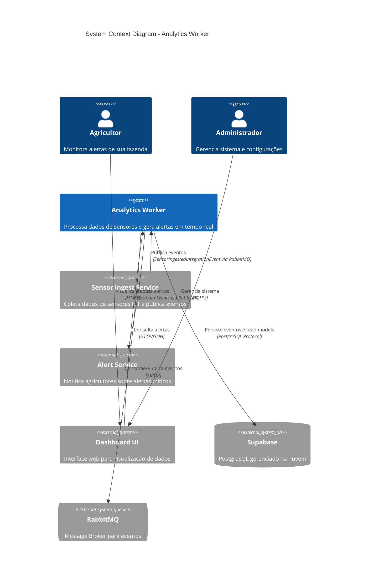

**Descrição:**

- **Analytics Worker** é o sistema central de análise de dados de sensores
- Consome eventos do **Sensor Ingest Service** via RabbitMQ
- Processa dados aplicando regras de negócio (detecção de alertas)
- Publica domain events para **Alert Service** notificar agricultores
- Expõe API REST para **Dashboard UI** consultar alertas
- Persiste eventos (Event Sourcing) e read models no **Supabase**

---

## 📦 **NÍVEL 2: CONTAINER DIAGRAM**

### **Containers e Tecnologias do Analytics Worker**

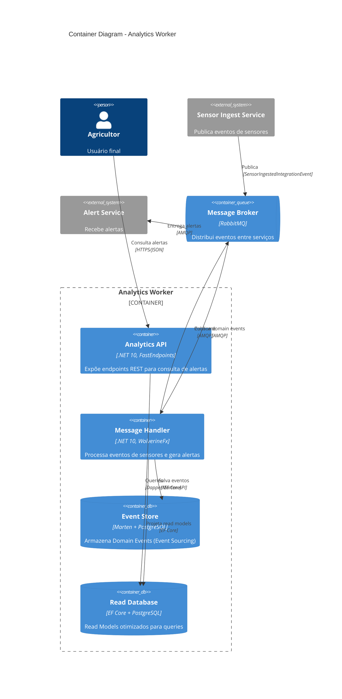

**Tecnologias por Container:**

| Container | Tecnologia | Propósito |
|-----------|------------|-----------|
| **Analytics API** | .NET 10 + FastEndpoints | Minimal APIs para consultas (CQRS Query Side) |
| **Message Handler** | WolverineFx + Marten | Processa comandos e eventos (CQRS Command Side) |
| **Event Store** | Marten + PostgreSQL | Event Sourcing - histórico completo de eventos |
| **Read Database** | EF Core + PostgreSQL | Read Models desnormalizados e otimizados |
| **Message Broker** | RabbitMQ | Comunicação assíncrona entre serviços |

---

## 🧩 **NÍVEL 3: COMPONENT DIAGRAM**

### **3.1 Analytics API (Query Side)**

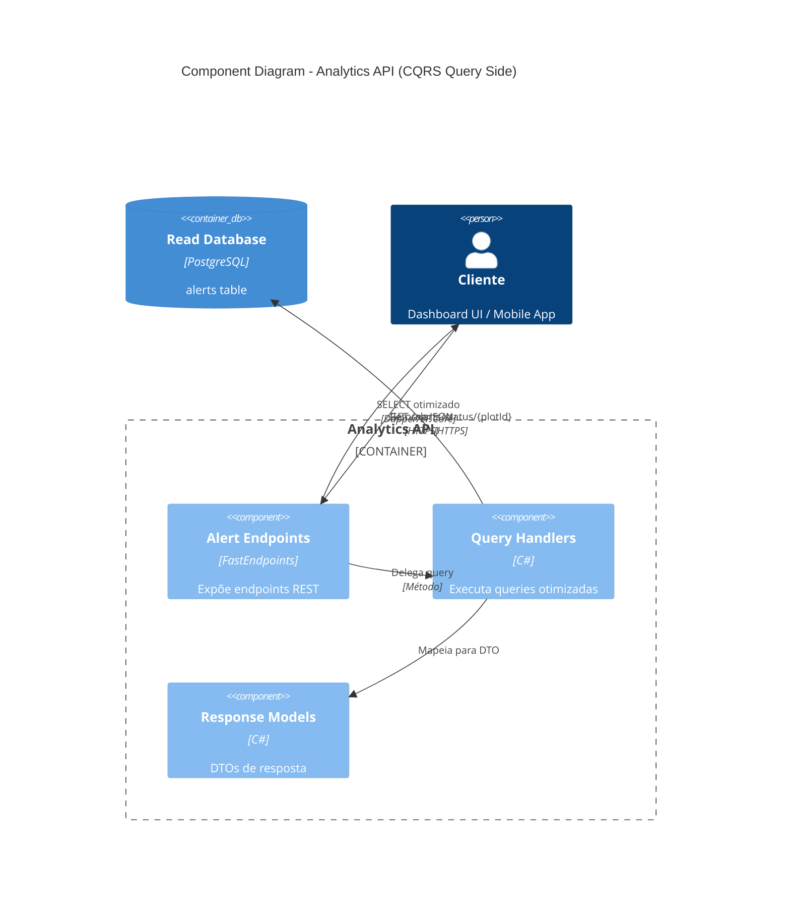

**Componentes - Query Side:**

1. **Alert Endpoints** (`AlertEndpoints.cs`)
   - `GetPendingAlertsEndpoint` - Lista alertas pendentes
   - `GetAlertHistoryEndpoint` - Histórico de alertas por talhão
   - `GetPlotStatusEndpoint` - Status geral do talhão

2. **Query Handlers** (`AlertQueries.cs`)
   - `GetPendingAlertsQueryHandler`
   - `GetAlertHistoryQueryHandler`
   - `GetPlotStatusQueryHandler`

3. **Response Models** (`AlertModels.cs`)
   - `AlertDto`
   - `PlotStatusDto`
   - `AlertHistoryDto`

---

### **3.2 Message Handler (Command Side)**

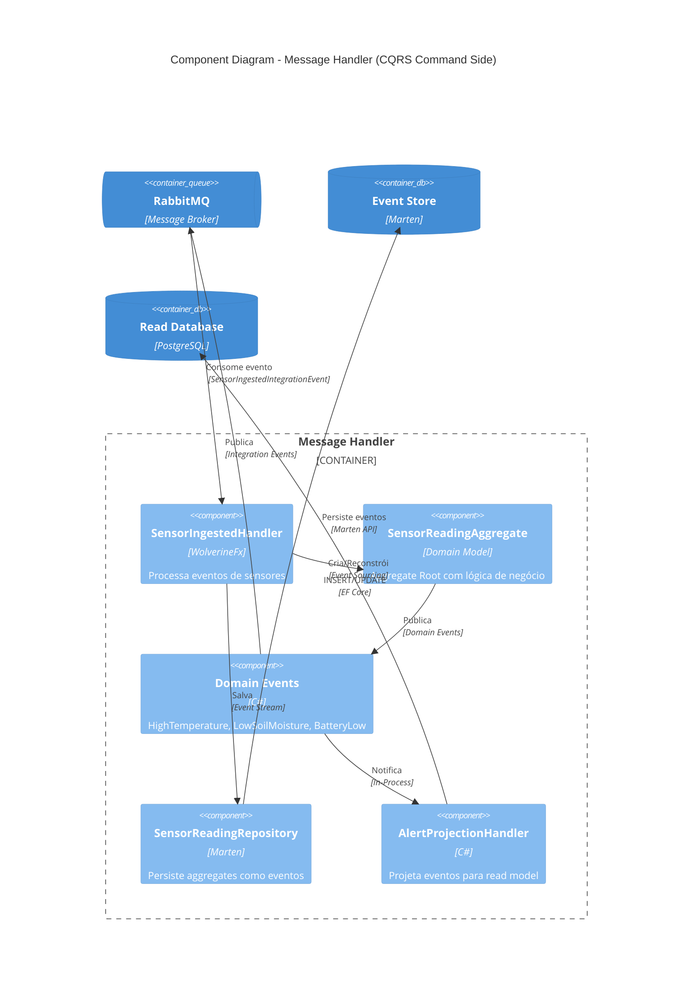

**Componentes - Command Side:**

1. **SensorIngestedHandler** (`SensorIngestedInHandler.cs`)
   - Processa `SensorIngestedIntegrationEvent`
   - Carrega ou cria `SensorReadingAggregate`
   - Aplica regras de negócio
   - Salva eventos via repository

2. **SensorReadingAggregate** (`SensorReadingAggregate.cs`)
   - Aggregate Root (DDD)
   - Métodos: `DetectAlerts()`, `UpdateReading()`
   - Publica Domain Events quando condições críticas detectadas

3. **Domain Events**
   - `HighTemperatureDetectedDomainEvent`
   - `LowSoilMoistureDetectedDomainEvent`
   - `BatteryLowWarningDomainEvent`

4. **SensorReadingRepository** (`SensorReadingRepository.cs`)
   - Implementa Event Sourcing com Marten
   - Métodos: `GetByIdAsync()`, `AddAsync()`

5. **AlertProjectionHandler** (`AlertProjectionHandler.cs`)
   - Escuta Domain Events
   - Projeta para `alerts` table (read model)
   - Implementa CQRS eventual consistency

---

## 🏗️ **CLEAN ARCHITECTURE - LAYERS**

### **Camadas e Dependências**

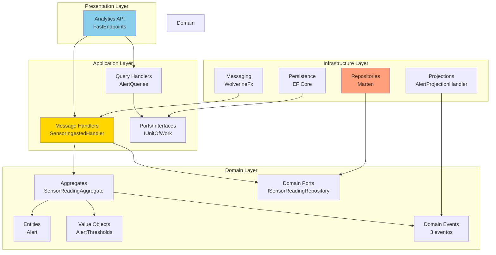

**Dependency Rule:**
- ✅ Domain não depende de nada
- ✅ Application depende apenas de Domain
- ✅ Infrastructure implementa interfaces do Domain
- ✅ Presentation depende de Application

---

## 🔄 **EVENT FLOW - SEQUENCE DIAGRAM**

### **Fluxo Completo: Sensor → Alerta → Notificação**

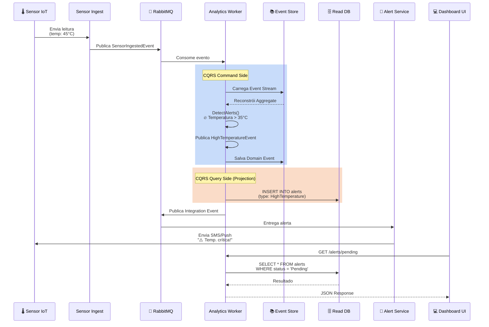

**Fluxo Detalhado:**

1. **Sensor IoT** envia leitura (temp: 45°C)
2. **Sensor Ingest** valida e publica `SensorIngestedIntegrationEvent`
3. **RabbitMQ** roteia evento para **Analytics Worker**
4. **Worker (Command Side):**
   - Carrega Event Stream do Marten
   - Reconstrói `SensorReadingAggregate`
   - Executa `DetectAlerts()` → detecta temperatura > 35°C
   - Publica `HighTemperatureDetectedDomainEvent`
   - Salva evento no Event Store (Marten)
5. **Worker (Query Side - Projection):**
   - `AlertProjectionHandler` escuta Domain Event
   - Projeta para `alerts` table no PostgreSQL
6. **Worker** publica Integration Event para **Alert Service**
7. **Alert Service** notifica agricultor (SMS/Push)
8. **Dashboard UI** consulta alertas via API REST

---

## 🗄️ **DATA FLOW - CQRS SEPARATION**

### **Separação Command/Query**

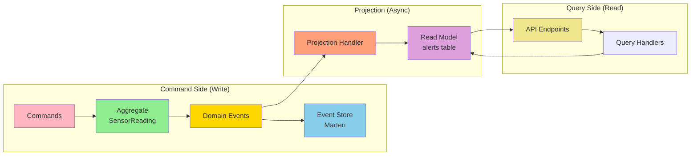

**Vantagens CQRS:**

| Aspecto | Command Side | Query Side |
|---------|--------------|------------|
| **Modelo** | Aggregate Root (rico) | Read Model (simples) |
| **Persistência** | Event Store (Marten) | Relational (PostgreSQL) |
| **Otimização** | Write-optimized | Read-optimized |
| **Consistência** | Strong (transacional) | Eventual |
| **Escalabilidade** | Vertical | Horizontal (replicas) |

---

## 📊 **DEPLOYMENT DIAGRAM**

### **Infraestrutura Cloud (Supabase + Railway)**

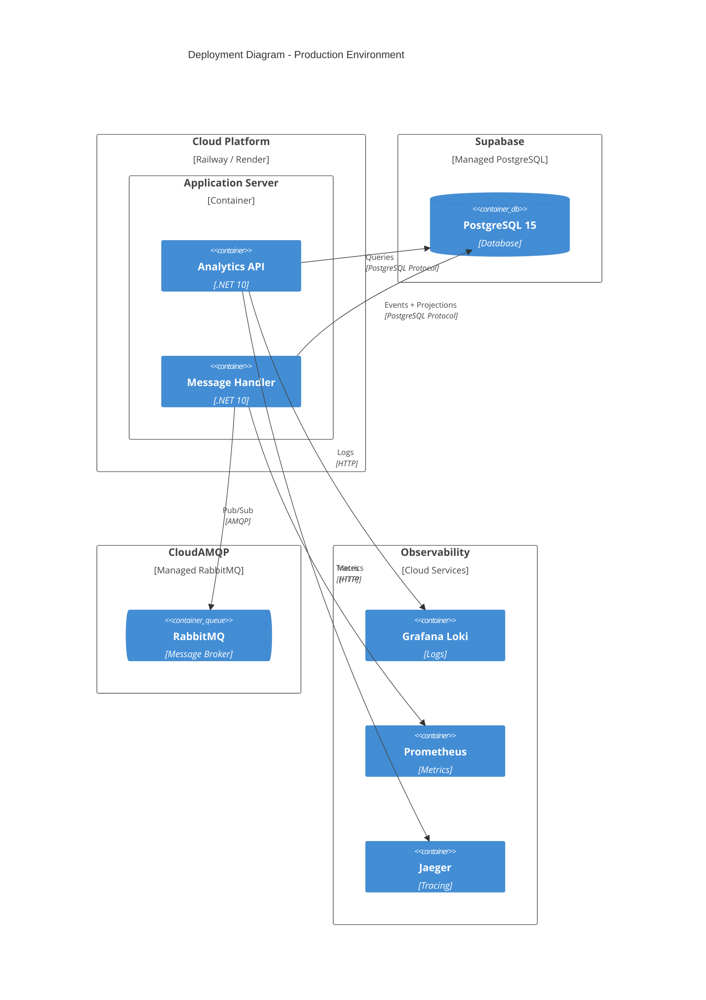

**Infraestrutura:**

- **Application:** Railway/Render (containers)
- **Database:** Supabase (PostgreSQL gerenciado)
- **Message Broker:** CloudAMQP (RabbitMQ gerenciado)
- **Observability:** Grafana Cloud Stack

---

## 🎨 **DOMAIN MODEL - CLASS DIAGRAM**

### **Principais Elementos do Domain**

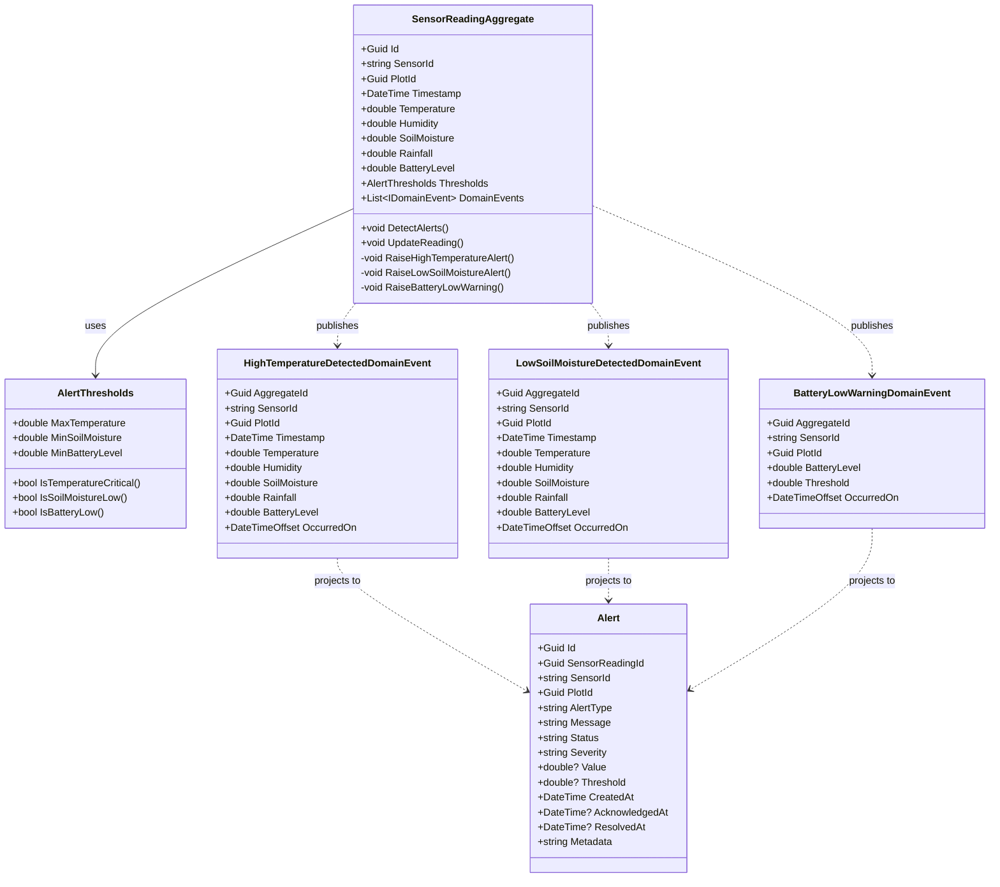

**Padrões DDD Implementados:**

- ✅ **Aggregate Root:** `SensorReadingAggregate`
- ✅ **Entity:** `Alert` (Read Model)
- ✅ **Value Object:** `AlertThresholds`
- ✅ **Domain Events:** 3 eventos ricos
- ✅ **Factory Methods:** No Aggregate
- ✅ **Repository Pattern:** `ISensorReadingRepository`

---

## 📈 **PERFORMANCE & SCALABILITY**

### **Estratégias de Otimização**

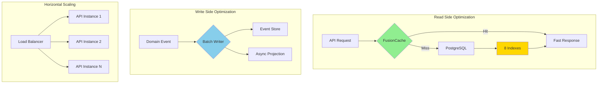

**Otimizações Implementadas:**

1. **Caching:** FusionCache para queries frequentes
2. **Indexação:** 8 índices no PostgreSQL
3. **Read Replicas:** Suporte a replicas read-only
4. **Connection Pooling:** Npgsql connection pooling
5. **Async Processing:** Projections assíncronas
6. **Batch Operations:** Marten batch append

---

## 🔒 **SECURITY ARCHITECTURE**

### **Camadas de Segurança**

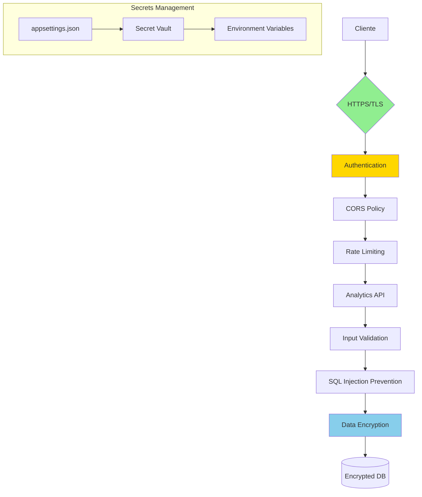

**Medidas de Segurança:**

- ✅ HTTPS/TLS obrigatório
- ✅ Secrets em variáveis de ambiente
- ✅ SQL Injection prevention (EF Core/Dapper)
- ✅ Input validation (FluentValidation)
- ✅ CORS configurado
- ⚠️ Rate Limiting recomendado
- ⚠️ API Keys/JWT recomendado

---

## 📚 **REFERENCIAS**

- **C4 Model:** https://c4model.com/
- **Clean Architecture:** Robert C. Martin
- **Domain-Driven Design:** Eric Evans
- **CQRS:** Martin Fowler
- **Event Sourcing:** Greg Young

---

## 🎯 **COMO USAR ESTE DOCUMENTO**

### **Renderização dos Diagramas:**

1. **No GitHub:** Diagramas Mermaid são renderizados automaticamente
2. **VS Code:** Instale extensão "Markdown Preview Mermaid Support"
3. **Confluence:** Use plugin Mermaid
4. **Ferramentas Online:** https://mermaid.live/

### **Atualização dos Diagramas:**

Ao evoluir a arquitetura:
1. Atualize os diagramas correspondentes
2. Mantenha consistência entre níveis (Context → Container → Component)
3. Documente decisões arquiteturais em ADRs

---

**Criado por:** GitHub Copilot AI  
**Data:** 01/02/2025  
**Versão:** 1.0  
**Formato:** Mermaid (C4 Model)
