# 📐 **C4 MODEL - ARCHITECTURE DIAGRAMS**
## **Analytics Worker - TC.Agro Solutions**

**Visual Architecture Documentation using C4 Model**

---

## 📚 **About the C4 Model**

The **C4 Model** is a software architecture documentation approach created by Simon Brown. It consists of 4 levels of abstraction:

1. **Context** - System and its users/external systems
2. **Container** - Applications, databases, services
3. **Component** - Internal components of each container
4. **Code** - Classes and interfaces (usually not needed)

**Reference:** https://c4model.com/

---

## 🌍 **LEVEL 1: CONTEXT DIAGRAM**

### **System in the Context of TC.Agro Ecosystem**


**Description:**

- **Analytics Worker** is the central system for sensor data analysis and alert management
- Consumes events from **Farm Management Service** (sensor lifecycle) and **Sensor Ingest Service** (sensor readings) via RabbitMQ
- Applies business rules to detect anomalies and create alerts
- Manages full alert lifecycle: Pending → Acknowledged → Resolved
- Exposes REST API for **Dashboard UI** to query alerts
- Provides real-time notifications via **SignalR** WebSocket connections
- Maintains sensor snapshots for optimized queries
- Persists alerts and snapshots in **Supabase** PostgreSQL

---

## 📦 **LEVEL 2: CONTAINER DIAGRAM**

### **Containers and Technologies of Analytics Worker**


**Technologies by Container:**

| Container | Technology | Purpose |
|-----------|------------|---------|
| **Analytics API** | .NET 10 + FastEndpoints | REST endpoints for alert queries (CQRS Query Side) |
| **Message Handlers** | WolverineFx + EF Core | Processes events and domain logic (CQRS Command Side) |
| **Read Database** | EF Core + PostgreSQL | Denormalized alerts and sensor snapshots |
| **SignalR Hub** | ASP.NET Core SignalR | Real-time WebSocket notifications to Dashboard UI |
| **Message Broker** | RabbitMQ | Asynchronous event-driven communication |

---

## 🧩 **LEVEL 3: COMPONENT DIAGRAM**

### **3.1 Analytics API (Query Side)**


**Query Side Components:**

1. **Alert Endpoints** (`AlertEndpoints/`)
   - `GetPendingAlertsEndpoint` - Lists pending alerts
   - `GetAlertHistoryEndpoint` - Alert history for a sensor
   - `GetSensorStatusEndpoint` - Current sensor status overview
   - `AcknowledgeAlertEndpoint` - Acknowledges an alert
   - `ResolveAlertEndpoint` - Resolves an alert

2. **Query Handlers** (`UseCases/Alerts/`)
   - `GetPendingAlertsQueryHandler`
   - `GetAlertHistoryQueryHandler`
   - `GetSensorStatusQueryHandler`

3. **Command Handlers** (`UseCases/Alerts/`)
   - `AcknowledgeAlertCommandHandler`
   - `ResolveAlertCommandHandler`

4. **Response Models** (Various DTOs)
   - `AlertDto`
   - `SensorStatusDto`
   - `AlertHistoryDto`

5. **SignalR Hub** (`Hubs/AlertHub.cs`)
   - `SubscribeToAlerts(sensorIds)` - Subscribe to specific sensor alerts
   - `UnsubscribeFromAlerts(sensorIds)` - Unsubscribe from updates
   - Real-time event push: `ReceiveAlert`, `AlertAcknowledged`, `AlertResolved`

---

### **3.2 Message Handlers (Command Side)**


**Command Side Components:**

1. **SensorIngestedInHandler** (`MessageBrokerHandlers/SensorIngestedInHandler.cs`)
   - Processes `SensorReadingIntegrationEvent`
   - Loads `SensorSnapshot` for metadata (plot, owner, thresholds)
   - Invokes `AlertAggregate.CreateFromSensorData()` with business rules
   - Persists alerts via `IAlertAggregateRepository`
   - Triggers real-time notifications via `IAlertHubNotifier`

2. **SensorSnapshotHandler** (`MessageBrokerHandlers/SensorSnapshotHandler.cs`)
   - Processes sensor lifecycle events:
     - `SensorRegisteredIntegrationEvent` → Create snapshot
     - `SensorOperationalStatusChangedIntegrationEvent` → Update status
     - `SensorDeactivatedIntegrationEvent` → Mark inactive
   - Maintains `sensor_snapshots` table for optimized queries

3. **OwnerSnapshotHandler** (`MessageBrokerHandlers/OwnerSnapshotHandler.cs`)
   - Processes `UserRegisteredIntegrationEvent` and `UserDeactivatedIntegrationEvent`
   - Maintains `owner_snapshots` table

4. **AlertAggregate** (`Aggregates/AlertAggregate.cs`)
   - DDD Aggregate Root with full lifecycle
   - Factory method: `CreateFromSensorData()` applies business rules:
     - Temperature > threshold → HighTemperature alert
     - SoilMoisture < threshold → LowSoilMoisture alert
     - BatteryLevel < threshold → LowBattery alert
   - State transitions: Pending → Acknowledged → Resolved
   - Methods: `Acknowledge()`, `Resolve()`

5. **SensorSnapshot** (`Snapshots/SensorSnapshot.cs`)
   - Domain entity (not aggregate)
   - Denormalized sensor data: owner, plot, property names
   - Optimizes queries by avoiding cross-service calls
   - Updated by events from Farm Management Service

6. **AlertHubNotifier** (`Services/AlertHubNotifier.cs`)
   - Implements `IAlertHubNotifier` interface
   - Injects `IHubContext<AlertHub>`
   - Pushes real-time notifications to subscribed SignalR clients
   - Methods: `NotifyNewAlert()`, `NotifyAlertAcknowledged()`, `NotifyAlertResolved()`

---

## 🏗️ **CLEAN ARCHITECTURE - LAYERS**

### **Layers and Dependencies**


**Clean Architecture Principles:**

| Layer | Description | Dependencies |
|-------|-------------|--------------|
| **Domain** | Business logic, aggregates, entities, value objects | None (pure domain) |
| **Application** | Use cases, handlers, ports (interfaces) | Domain only |
| **Infrastructure** | Repositories, EF Core, messaging, SignalR | Application, Domain |
| **Presentation** | FastEndpoints, SignalR Hub, DTOs | Application, Domain |

**Dependency Rule:**
- ✅ Domain has zero dependencies (pure business logic)
- ✅ Application depends only on Domain
- ✅ Infrastructure implements Application interfaces (Dependency Inversion)
- ✅ Presentation depends on Application (controllers/endpoints call use cases)

**Key Projects:**

1. **TC.Agro.Analytics.Domain** - Core domain models
2. **TC.Agro.Analytics.Application** - Use cases and handlers
3. **TC.Agro.Analytics.Infrastructure** - EF Core, repositories, persistence
4. **TC.Agro.Analytics.Service** - FastEndpoints API + SignalR Hub
5. **TC.Agro.Contracts** - Integration event contracts (shared)
6. **TC.Agro.SharedKernel** - Common patterns (BaseAggregateRoot, Result, etc.)
7. **TC.Agro.Messaging** - WolverineFx extensions

---

## 🔄 **EVENT FLOW - SEQUENCE DIAGRAM**

### **Complete Flow: Sensor Reading → Alert → Real-time Notification**

```mermaid
sequenceDiagram
    participant Sensor as 🌡️ IoT Sensor
    participant Ingest as Sensor Ingest
    participant RabbitMQ as 🐰 RabbitMQ
    participant Worker as Analytics Worker
    participant Postgres as 🗄️ PostgreSQL
    participant Hub as 🔔 AlertHub (SignalR)
    participant UI as 💻 Dashboard UI

    Sensor->>Ingest: Sends reading<br/>(temp: 45°C)
    Ingest->>RabbitMQ: Publishes SensorReadingIntegrationEvent

    RabbitMQ->>Worker: Consumes event (WolverineFx)

    rect rgb(200, 220, 250)
        Note over Worker: Command Side - Business Logic
        Worker->>Postgres: Loads SensorSnapshot<br/>(plot, owner, thresholds)
        Postgres-->>Worker: Returns metadata
        Worker->>Worker: AlertAggregate.CreateFromSensorData()<br/>🔥 Temperature > 35°C → Alert!
        Worker->>Postgres: INSERT INTO alerts<br/>(status: Pending, severity: Critical)
    end

    rect rgb(250, 220, 200)
        Note over Worker: Real-time Notification
        Worker->>Hub: IAlertHubNotifier.NotifyNewAlert()
        Hub->>UI: Pushes alert via WebSocket<br/>"⚠️ Critical temperature!"
    end

    Worker->>RabbitMQ: Publishes AlertCreatedEvent<br/>(for other services)

    UI->>Worker: GET /api/alerts/pending
    Worker->>Postgres: SELECT * FROM alerts<br/>WHERE status = 'Pending'
    Postgres-->>Worker: Results
    Worker-->>UI: JSON Response

    UI->>Worker: POST /api/alerts/{id}/acknowledge
    Worker->>Postgres: UPDATE alerts SET status = 'Acknowledged'
    Worker->>Hub: NotifyAlertAcknowledged()
    Hub->>UI: Pushes update via WebSocket
```



**Detailed Flow:**

1. **IoT Sensor** sends reading (temp: 45°C) to Sensor Ingest Service
2. **Sensor Ingest** validates and publishes `SensorReadingIntegrationEvent` to RabbitMQ
3. **RabbitMQ** routes event to **Analytics Worker** (WolverineFx handler)
4. **Worker (Command Side):**
   - `SensorIngestedInHandler` receives event
   - Loads `SensorSnapshot` from PostgreSQL (contains plot, owner, thresholds)
   - Invokes `AlertAggregate.CreateFromSensorData()` → applies business rules
   - Detects: temperature (45°C) > threshold (35°C) → creates **HighTemperature** alert
   - Persists alert to PostgreSQL via `IAlertAggregateRepository`
5. **Worker (Real-time Notification):**
   - `IAlertHubNotifier.NotifyNewAlert()` triggers SignalR notification
   - `AlertHub` pushes event to subscribed clients via WebSocket
   - Dashboard UI receives instant notification without polling
6. **Worker** publishes `AlertCreatedIntegrationEvent` to RabbitMQ (for other services)
7. **Dashboard UI** queries alerts via REST API (CQRS Query Side)
8. **User** acknowledges alert → triggers state transition (Pending → Acknowledged)
9. **SignalR** pushes acknowledgment update to all subscribed clients

---

## 🗄️ **DATA FLOW - CQRS PATTERN**

### **Command/Query Separation**


**CQRS Benefits:**

| Aspect | Command Side | Query Side |
|--------|--------------|------------|
| **Model** | Rich Aggregate (AlertAggregate) | Simple DTOs |
| **Persistence** | EF Core (write-optimized) | EF Core (read-optimized) |
| **Optimization** | Business rule validation | Fast queries with indexes |
| **Consistency** | Strong (transactional) | Strong (same database) |
| **Scalability** | Vertical | Horizontal (read replicas) |
| **Real-time** | Triggers SignalR notifications | Polls via HTTP requests |

**Why CQRS in Analytics Worker?**

1. **Separate concerns:** Commands apply business rules; queries optimize for reads
2. **Performance:** Query side uses denormalized `sensor_snapshots` for fast joins
3. **Real-time:** Command side triggers immediate SignalR notifications
4. **Scalability:** Read replicas can scale independently
5. **Maintainability:** Clear separation of write and read logic

---

## 📊 **DEPLOYMENT DIAGRAM**

### **Cloud Infrastructure (Supabase + Railway/Render)**


**Infrastructure:**

- **Application:** Railway/Render/Azure App Service (containerized .NET 10 app)
- **Database:** Supabase PostgreSQL 15+ (managed, with connection pooling)
- **Message Broker:** CloudAMQP RabbitMQ (managed, with high availability)
- **Real-time:** SignalR hub running in same process as API (sticky sessions required for scale-out)
- **Observability:** Azure Monitor Application Insights + Prometheus for metrics

**Deployment Considerations:**

1. **SignalR Sticky Sessions:** Required when scaling to multiple instances (use Redis backplane for scale-out)
2. **Database Migrations:** Applied automatically on startup via `ApplyMigrations()` extension
3. **Environment Variables:** Secrets managed via platform environment variables (Railway/Render secrets, Azure Key Vault)
4. **Health Checks:** `/health` endpoint for container orchestration
5. **CORS:** Configured for Dashboard UI domain
6. **Ingress Path Base:** Supports nginx `rewrite-target` for path-based routing

---

## 🎨 **DOMAIN MODEL - CLASS DIAGRAM**

### **Core Domain Elements**


**DDD Patterns Implemented:**

- ✅ **Aggregate Root:** `AlertAggregate` (manages alert lifecycle)
- ✅ **Entity:** `SensorSnapshot`, `OwnerSnapshot` (domain entities with identity)
- ✅ **Value Object:** `AlertThresholds` (immutable business rules)
- ✅ **Enumerations:** `AlertType`, `AlertSeverity`, `AlertStatus` (domain vocabulary)
- ✅ **Factory Methods:** `CreateFromSensorData()`, `CreateFromEvent()`
- ✅ **Repository Pattern:** `IAlertAggregateRepository`, `ISensorSnapshotStore`
- ✅ **Ubiquitous Language:** Domain terms match business terminology

**Alert Lifecycle State Machine:**

```
Pending → Acknowledged → Resolved
   ↓
Expired (if not acknowledged within time window)
```

**Business Rules (in AlertAggregate):**

1. **Temperature Rule:** `temperature > AlertThresholds.MaxTemperature` → HighTemperature alert (Critical severity)
2. **Soil Moisture Rule:** `soilMoisture < AlertThresholds.MinSoilMoisture` → LowSoilMoisture alert (High severity)
3. **Battery Rule:** `batteryLevel < AlertThresholds.MinBatteryLevel` → LowBattery alert (Medium severity)
4. **State Transition Rules:**
   - Can only acknowledge alert in Pending state
   - Can only resolve alert in Acknowledged state
   - Cannot modify alert in Resolved or Expired state

---

## 📈 **PERFORMANCE & SCALABILITY**

### **Optimization Strategies**


**Optimizations Implemented:**

1. **Indexes:** Database indexes on `alerts` table for fast queries
   - `idx_alerts_sensor_status` - Composite index on (SensorId, Status, CreatedAt)
   - `idx_alerts_created_at` - Index on CreatedAt for time-based queries
   - `idx_sensor_snapshots_owner` - Index on OwnerId for owner-based queries

2. **Denormalized Snapshots:** `sensor_snapshots` table contains pre-joined data (plot, property, owner names)
   - Eliminates cross-service calls during query time
   - Updated asynchronously via events

3. **Connection Pooling:** Npgsql connection pooling enabled in connection string

4. **Async Processing:** All handlers use async/await for non-blocking I/O

5. **Real-time Push:** SignalR avoids polling overhead for alert updates

**Future Optimizations:**

- ⚠️ **Caching Layer:** Redis for frequently accessed data (pending)
- ⚠️ **Read Replicas:** PostgreSQL read replicas for query scaling (pending)
- ⚠️ **SignalR Backplane:** Redis backplane for SignalR scale-out (required for multiple instances)
- ⚠️ **Rate Limiting:** Protect API from abuse (pending)

**Scalability Targets:**

| Metric | Target | Current |
|--------|--------|---------|
| **Throughput** | 10,000+ events/min | ~1,000 events/min (single instance) |
| **Latency (p95)** | < 100ms | ~50ms (queries), ~20ms (writes) |
| **Concurrent Connections** | 10,000+ WebSocket | Limited by single instance |
| **Data Retention** | 12 months | Unlimited (no archival yet) |

---

## 🔒 **SECURITY ARCHITECTURE**

### **Security Layers**


**Security Measures:**

- ✅ **HTTPS/TLS:** Enforced in production (handled by cloud platform)
- ✅ **Secrets Management:** Sensitive data in environment variables
- ✅ **SQL Injection Prevention:** EF Core parameterized queries
- ✅ **Input Validation:** FluentValidation on commands
- ✅ **CORS:** Configured for Dashboard UI domain
- ✅ **Correlation IDs:** Request tracking via `CorrelationMiddleware`
- ⚠️ **Authentication:** Planned (JWT tokens from Identity Service)
- ⚠️ **Authorization:** Planned (role-based access control)
- ⚠️ **Rate Limiting:** Recommended for API protection

**Planned Security Enhancements:**

1. **JWT Authentication:** Integrate with TC.Agro Identity Service
2. **Role-Based Access:** Farmers see only their sensors; admins see all
3. **API Keys:** For programmatic access
4. **Rate Limiting:** Throttle requests per IP/user
5. **Azure Key Vault:** Centralized secrets management

---

## 🔍 **OBSERVABILITY & MONITORING**

### **Telemetry Stack**


**Telemetry Implementation:**

1. **Structured Logging (Serilog):**
   - Correlation IDs for request tracking
   - Contextual properties: `SensorId`, `AlertId`, `EventType`
   - Log levels: Debug, Info, Warning, Error, Fatal
   - Sinks: Console, Azure Monitor (Application Insights)

2. **Distributed Tracing (OpenTelemetry):**
   - Traces message processing: RabbitMQ → Handler → Database
   - Custom spans for business operations: `CreateAlertFromSensorData`
   - Activity IDs propagated across service boundaries

3. **Metrics (OpenTelemetry):**
   - **Counter:** `alerts_created_total` (by type, severity)
   - **Histogram:** `sensor_reading_processing_duration_ms`
   - **Gauge:** `active_signalr_connections`
   - **Counter:** `signalr_messages_sent_total`

4. **Health Checks:**
   - `/health` endpoint - Overall health
   - Checks: Database connectivity, RabbitMQ connectivity

**Key Metrics Tracked:**

| Metric | Description | Alert Threshold |
|--------|-------------|-----------------|
| `alerts_created_total` | Alerts created per minute | > 1000/min (anomaly) |
| `sensor_reading_processing_duration_ms` | Time to process reading | p95 > 500ms |
| `database_query_duration_ms` | Database query latency | p95 > 200ms |
| `rabbitmq_message_consumption_rate` | Messages consumed/sec | < 10/sec (degraded) |
| `active_signalr_connections` | Active WebSocket connections | N/A (monitoring only) |

**Configuration:**

Telemetry configuration in `appsettings.json`:
```json
{
  "Telemetry": {
    "ServiceName": "analytics-worker",
    "ServiceVersion": "1.0.0",
    "Exporters": {
      "AzureMonitor": {
        "Enabled": true,
        "ConnectionString": "env:APPLICATIONINSIGHTS_CONNECTION_STRING"
      },
      "OTLP": {
        "Enabled": false,
        "Endpoint": "http://otel-collector:4317"
      }
    }
  }
}
```

---

## 📚 **REFERENCES**

- **C4 Model:** https://c4model.com/
- **Clean Architecture:** Robert C. Martin - "Clean Architecture: A Craftsman's Guide to Software Structure and Design"
- **Domain-Driven Design:** Eric Evans - "Domain-Driven Design: Tackling Complexity in the Heart of Software"
- **CQRS:** Martin Fowler - https://martinfowler.com/bliki/CQRS.html
- **SignalR:** Microsoft Docs - https://learn.microsoft.com/aspnet/core/signalr/introduction
- **OpenTelemetry:** https://opentelemetry.io/
- **WolverineFx:** https://wolverine.netlify.app/

---

## 🎯 **HOW TO USE THIS DOCUMENT**

### **Rendering Diagrams:**

1. **On GitHub:** Mermaid diagrams render automatically in markdown preview
2. **VS Code:** Install "Markdown Preview Mermaid Support" extension
3. **Confluence:** Use Mermaid plugin
4. **Online Tools:** https://mermaid.live/

### **Updating Diagrams:**

When evolving the architecture:
1. Update corresponding diagrams at each level (Context → Container → Component)
2. Maintain consistency between levels
3. Document architectural decisions in ADRs (Architecture Decision Records)
4. Update deployment diagram when infrastructure changes
5. Keep domain model in sync with actual code

### **Diagram Conventions:**

- **Blue boxes:** Internal containers/components
- **Gray boxes:** External systems/services
- **Solid arrows:** Synchronous calls (HTTP, method calls)
- **Dashed arrows:** Asynchronous communication (events, messages)
- **Database symbols:** Data stores
- **Queue symbols:** Message brokers

---

## 📝 **DOCUMENT METADATA**

**Created by:** TC.Agro Development Team (with GitHub Copilot assistance)  
**Last Updated:** February 2025  
**Version:** 2.0  
**Format:** Markdown + Mermaid (C4 Model)  
**Target Framework:** .NET 10  
**Status:** ✅ Production-ready (with planned enhancements noted)

---

**Note:** This documentation reflects the current state of the Analytics Worker service as of February 2025. For code-level details, refer to inline documentation in the codebase.

